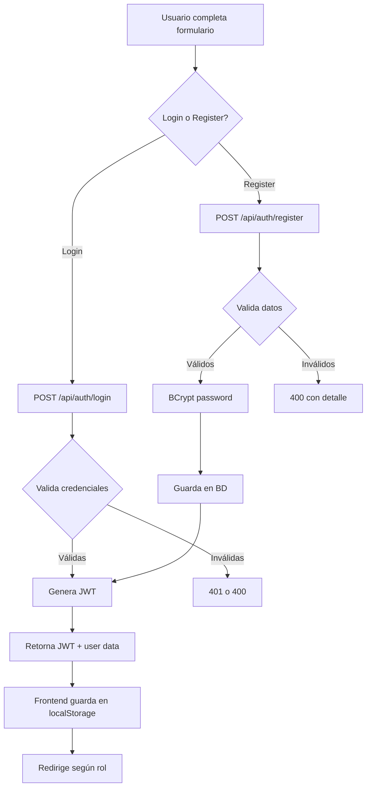

# Backend - Auth JWT

## DNA (Document Metadata)

| Field | Value |
|-------|-------|
| **Jira** | TBD |
| **Status** | Draft |
| **Author** | Pablo Garay |
| **Date** | 2026-05-16 |
| **Stakeholders** | Equipo TPI |
| **Version** | 0.1 |

---

## 1. Problem Statement

El frontend actual maneja autenticación contra localStorage, lo cual no es seguro ni escalable. Necesitamos endpoints REST de login y register que:
- Validen credenciales contra la base de datos
- Generen tokens JWT para sesiones stateless
- Retornen datos del usuario (sin password) junto al token
- Solo permitan registro de usuarios con rol `USUARIO` (client)
- El usuario ADMIN se crea via seed data (HU-027), no via register

---

## 2. Context & Background

- **Depende de**: back-infrastructure (JwtProvider, SecurityConfig, PasswordEncoder)
- **Login**: POST `/api/auth/login` — público
- **Register**: POST `/api/auth/register` — público
- **Logout**: es responsabilidad del frontend (eliminar token)
- **Roles**: `ADMIN` y `USUARIO` (enum)
- Passwords se almacenan encriptadas con BCrypt

---

## 3. Goals & Success Metrics

### Primary Goal
Endpoints de autenticación seguros que emitan JWT para sesiones stateless.

### Success Metrics
- Login exitoso < 200ms
- 100% de validaciones cubiertas en tests
- Sin contraseñas en texto plano en logs ni respuestas

---

## 4. Target Users

- **Visitante**: se registra como USUARIO
- **Usuario registrado**: inicia sesión con email + password

---

## 5. User Stories

### US-01: Login
**As a** Usuario registrado
**I want** iniciar sesión con email y contraseña
**So that** acceder a mi cuenta y obtener un token JWT

**Acceptance Criteria:**
- [ ] POST `/api/auth/login` con credenciales válidas → 200 + token + user data
- [ ] Email no existe → 401 "Email o contraseña inválidos"
- [ ] Password incorrecta → 401 "Email o contraseña inválidos" (mismo mensaje)
- [ ] Email vacío → 400 "Email es requerido"
- [ ] Password vacío → 400 "Password es requerido"
- [ ] Email con formato inválido → 400 "Email inválido"
- [ ] Usuario eliminado (soft delete) → 401 No autorizado
- [ ] Response incluye: token, type, id, email, nombre, rol
- [ ] Tests de integración para cada escenario

**Request:**
```json
{
  "email": "admin@admin.com",
  "password": "123456"
}
```

**Response 200:**
```json
{
  "token": "eyJhbGciOiJIUzI1NiJ9...",
  "type": "Bearer",
  "id": 1,
  "email": "admin@admin.com",
  "nombre": "Admin",
  "apellido": "Sistema",
  "role": "ADMIN"
}
```

### US-02: Register
**As a** Visitante
**I want** registrarme como nuevo usuario
**So that** poder realizar compras en el sistema

**Acceptance Criteria:**
- [ ] POST `/api/auth/register` con datos válidos → 201 + token + user data
- [ ] Email ya registrado → 400 "El email ya está registrado"
- [ ] Nombre vacío → 400 "El nombre es obligatorio"
- [ ] Apellido vacío → 400 "El apellido es obligatorio"
- [ ] Password < 6 caracteres → 400 "La contraseña debe tener al menos 6 caracteres"
- [ ] Email inválido → 400 "Email inválido"
- [ ] No se puede registrar con rol ADMIN (se ignora si se envía)
- [ ] Password no se incluye en la respuesta
- [ ] Usuario se crea con rol `USUARIO`
- [ ] Auto-login: se retorna token JWT en la misma respuesta

**Request:**
```json
{
  "nombre": "Juan",
  "apellido": "Perez",
  "email": "juan@email.com",
  "celular": "1234567890",
  "password": "miPassword123"
}
```

**Response 201:**
```json
{
  "token": "eyJhbGciOiJIUzI1NiJ9...",
  "type": "Bearer",
  "id": 2,
  "email": "juan@email.com",
  "nombre": "Juan",
  "apellido": "Perez",
  "celular": "1234567890",
  "role": "USUARIO"
}
```

---

## 6. Functional Requirements

### FR-01: Login Endpoint
`POST /api/auth/login` — público, retorna JWT + datos usuario.

### FR-02: Register Endpoint
`POST /api/auth/register` — público, crea usuario USUARIO, retorna JWT + datos.

### FR-03: Validaciones de Login
- Email requerido + formato válido
- Password requerida
- Usuario existe + no eliminado
- Password coincide con hash BCrypt
- Mensaje genérico "Email o contraseña inválidos" (no revelar cuál falló)

### FR-04: Validaciones de Register
- Nombre: obligatorio, 2-50 caracteres
- Apellido: obligatorio, 2-50 caracteres
- Email: obligatorio, formato válido, único en BD
- Celular: opcional, máx 20 caracteres
- Password: obligatorio, mínimo 6 caracteres
- Rol: siempre USUARIO (ignorar si se envía)

### FR-05: JWT Token Generation
- Token generado via `JwtProvider.generateToken()` de back-infrastructure
- Claims: userId, email, role
- Expiración: configurable via properties (default 24h)

---

## 7. Non-Functional Requirements

| Category | ID | Requirement |
|----------|--------|-------------|
| **Security** | NFR-01 | Contraseñas NUNCA en logs ni respuestas |
| **Security** | NFR-02 | Mensaje de error genérico en login (no revelar qué falló) |
| **Security** | NFR-03 | Rate limiting deseable (fuera de scope para v1) |
| **Performance** | NFR-04 | Login response < 500ms |

---

## 8. User Flow



---

## 9. API / Interface Contracts

### POST `/api/auth/login`
**Request:**
```json
{
  "email": "string (obligatorio)",
  "password": "string (obligatorio)"
}
```

**Response 200:**
```json
{
  "token": "string (JWT)",
  "type": "Bearer",
  "id": 1,
  "email": "admin@admin.com",
  "nombre": "Admin",
  "apellido": "Sistema",
  "celular": "1234567890",
  "role": "ADMIN"
}
```

**Response 401:**
```json
{
  "error": "invalid_credentials",
  "message": "Email o contraseña inválidos",
  "status": 401
}
```

### POST `/api/auth/register`
**Request:**
```json
{
  "nombre": "string (obligatorio, 2-50)",
  "apellido": "string (obligatorio, 2-50)",
  "email": "string (obligatorio, email, único)",
  "celular": "string (opcional, máx 20)",
  "password": "string (obligatorio, min 6)"
}
```

**Response 201:**
```json
{
  "token": "string (JWT)",
  "type": "Bearer",
  "id": 2,
  "email": "juan@email.com",
  "nombre": "Juan",
  "apellido": "Perez",
  "celular": "1234567890",
  "role": "USUARIO"
}
```

---

## 10. Data Model

No hay tablas nuevas. Usa `Usuario` definido en `back-users`.

---

## 11. DoD (Definition of Done)

### Testing
- [ ] Tests de integración: login exitoso retorna token
- [ ] Tests de integración: register exitoso retorna token y usuario creado
- [ ] Tests: email inválido → 400
- [ ] Tests: email duplicado → 400
- [ ] Tests: password incorrecta → 401 (genérico)
- [ ] Tests: usuario eliminado no puede loguearse
- [ ] Tests: password no aparece en response
- [ ] Tests: register ignora rol enviado (siempre USUARIO)

### Código
- [ ] `AuthController` con login y register
- [ ] `AuthService` con lógica de autenticación
- [ ] DTOs: `LoginRequest`, `RegisterRequest`, `AuthResponse`
- [ ] `AuthResponse` usa JwtProvider para generar token
- [ ] Sin security code smells (passwords en logs, etc.)

---

## 12. Out of Scope

- Refresh tokens
- Verificación de email
- Recuperación de contraseña
- 2FA / MFA
- Rate limiting

---

## 13. Dependencies

| Dependency | Type |
|------------|------|
| back-infrastructure | Internal (JwtProvider, PasswordEncoder, SecurityConfig) |
| back-users | Internal (Usuario entity, repository) |

---

## 14. Risks & Mitigations

| Risk | Probability | Impact | Mitigation |
|------|-------------|--------|------------|
| Password en logs | Medium | High | Revisar @ToString exclude, no loggear request bodies completos |
| Token泄露 | Medium | High | HTTPS, expiration 24h |

---

## Changelog

| Version | Date | Author | Changes |
|---------|------|--------|---------|
| 0.1 | 2026-05-16 | Pablo Garay | Initial draft |
