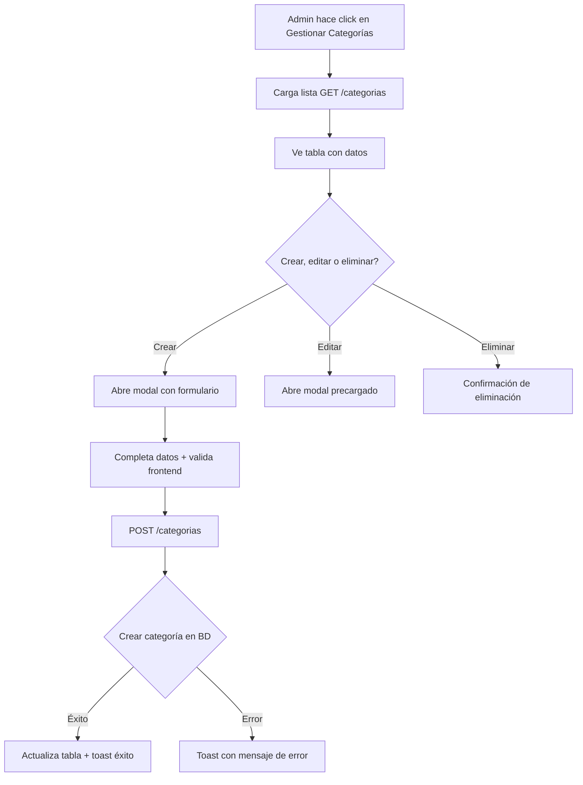

# Backend - Categories

## DNA (Document Metadata)

| Field | Value |
|-------|-------|
| **Jira** | TBD |
| **Status** | Draft |
| **Author** | Pablo Garay |
| **Date** | 2026-05-16 |
| **Stakeholders** | Equipo TPI |
| **Version** | 0.1 |

---

## 1. Problem Statement

El sistema necesita organizar los productos en categorías para facilitar la navegación y búsqueda. Actualmente no existe backend que persista categorías. Se requiere un CRUD completo administrado solo por usuarios con rol ADMIN.

---

## 2. Context & Background

- **Depende de**: back-infrastructure (BaseEntity, BaseRepository, ExceptionHandler, auth JWT)
- **Solo ADMIN** puede crear, modificar y eliminar categorías
- **Cualquier usuario autenticado** puede listar y ver categorías
- Se implementa soft delete: las categorías eliminadas no se muestran pero permanecen en BD
- Las categorías tienen imagen asociada (URL)

---

## 3. Goals & Success Metrics

### Primary Goal
CRUD completo de categorías con validaciones, soft delete y autorización por roles.

### Success Metrics

| Metric | Target | How to Measure |
|--------|--------|----------------|
| Tiempo de respuesta GET /categorias | < 100ms | Test de performance |
| Cobertura de validaciones | 100% | Tests de cada escenario de error |

---

## 4. Target Users

- **Administrador**: crea, edita, elimina categorías
- **Cliente**: visualiza categorías en el sidebar del catálogo

---

## 5. User Stories

### US-01 (HU-001): Crear Categoría
**As a** Administrador
**I want** crear nuevas categorías de productos
**So that** organizar el catálogo de manera estructurada

**Acceptance Criteria:**
- [ ] POST `/api/v1/categorias` con token ADMIN → 201 Created
- [ ] Nombre vacío → 400 "El nombre es obligatorio"
- [ ] Nombre < 2 caracteres → 400 "El nombre debe tener entre 2 y 100 caracteres"
- [ ] Nombre > 100 caracteres → 400
- [ ] Descripción > 500 caracteres → 400
- [ ] URL de imagen inválida → 400
- [ ] Usuario sin rol ADMIN → 403 Forbidden

**Request:**
```json
{
  "nombre": "Hamburguesas",
  "descripcion": "Las mejores hamburguesas del mercado",
  "imagen": "https://ejemplo.com/hamburguesas.jpg"
}
```

**Response (201):**
```json
{
  "id": 1,
  "nombre": "Hamburguesas",
  "descripcion": "Las mejores hamburguesas del mercado",
  "imagen": "https://ejemplo.com/hamburguesas.jpg"
}
```

### US-02 (HU-002): Listar Categorías
**As a** Usuario del sistema
**I want** ver todas las categorías disponibles
**So that** poder navegar y filtrar productos por categoría

**Acceptance Criteria:**
- [ ] GET `/api/v1/categorias` → 200 con array de categorías activas
- [ ] Sin categorías → 200 con `[]`
- [ ] No retorna categorías con `eliminado = true`
- [ ] No requiere rol específico (solo autenticación)

### US-03 (HU-003): Obtener Categoría por ID
**As a** Usuario del sistema
**I want** ver detalle de una categoría específica
**So that** conocer su información

**Acceptance Criteria:**
- [ ] GET `/api/v1/categorias/1` → 200 con datos de la categoría
- [ ] ID no existe → 404 "Entidad con id 999 no encontrado"
- [ ] Categoría eliminada (soft delete) → 404 Not Found

### US-04 (HU-004): Actualizar Categoría
**As a** Administrador
**I want** modificar una categoría existente
**So that** mantener la información actualizada

**Acceptance Criteria:**
- [ ] PUT `/api/v1/categorias/1` con token ADMIN → 200 OK
- [ ] Actualización parcial: solo campos enviados se modifican
- [ ] Nombre inválido → 400
- [ `] ID no existe → 404
- [ ] Usuario sin ADMIN → 403

### US-05 (HU-005): Eliminar Categoría (Soft Delete)
**As a** Administrador
**I want** eliminar una categoría
**So that** mantener el catálogo limpio

**Acceptance Criteria:**
- [ ] DELETE `/api/v1/categorias/1` con token ADMIN → 204 No Content
- [ ] `eliminado = true` en BD, registro no se borra
- [ ] No existe → 404
- [ ] Ya eliminada → 404
- [ ] Productos asociados NO se eliminan

---

## 6. Functional Requirements

### FR-01: Endpoints CRUD
- POST `/api/v1/categorias` — crear (ADMIN)
- GET `/api/v1/categorias` — listar (autenticado)
- GET `/api/v1/categorias/{id}` — obtener (autenticado)
- PUT `/api/v1/categorias/{id}` — actualizar (ADMIN)
- DELETE `/api/v1/categorias/{id}` — eliminar soft (ADMIN)

### FR-02: Validaciones
- Nombre: obligatorio, 2-100 caracteres
- Descripción: opcional, máx 500 caracteres
- Imagen: opcional, URL válida si se envía

### FR-03: Soft Delete
- No se borra físicamente
- `eliminado = true` impide visualización
- Productos asociados no se ven afectados

### FR-04: Autorización
- `@PreAuthorize("hasRole('ADMIN')")` en operaciones de escritura
- Lectura requiere solo autenticación

---

## 7. Non-Functional Requirements

| Category | ID | Requirement |
|----------|--------|-------------|
| **Seguridad** | NFR-01 | Solo ADMIN puede modificar/eliminar |
| **Consistencia** | NFR-02 | Nombre único entre categorías activas |
| **Rendimiento** | NFR-03 | Respuesta < 200ms |

---

## 8. User Flow



---

## 9. API / Interface Contracts

### POST `/api/v1/categorias`
**Request:**
```json
{
  "nombre": "string (obligatorio, 2-100)",
  "descripcion": "string (opcional, máx 500)",
  "imagen": "string (opcional, URL)"
}
```

**Response 201:**
```json
{
  "id": 1,
  "nombre": "Hamburguesas",
  "descripcion": "Las mejores hamburguesas del mercado",
  "imagen": "https://ejemplo.com/hamburguesas.jpg"
}
```

### GET `/api/v1/categorias`
**Response 200:**
```json
[
  {
    "id": 1,
    "nombre": "Hamburguesas",
    "descripcion": "...",
    "imagen": "..."
  }
]
```

### DELETE `/api/v1/categorias/{id}`
**Response 204** — No Content

---

## 10. Data Model

### Categoria (extiende Base)

| Campo | Tipo | Constraint | Descripción |
|-------|------|------------|-------------|
| id | Long | PK, auto | Heredado de Base |
| nombre | String | NOT NULL, unique, 2-100 | Nombre de categoría |
| descripcion | String | nullable, máx 500 | Descripción |
| imagen | String | nullable | URL de imagen |
| eliminado | Boolean | default false | Soft delete (Base) |
| createdAt | LocalDateTime | auto | Timestamp (Base) |
| updatedAt | LocalDateTime | auto | Timestamp (Base) |

---

## 11. DoD (Definition of Done)

### Testing
- [ ] Tests unitarios de `CategoriaService`: crear, listar, obtener, actualizar, eliminar
- [ ] Tests de integración de `CategoriaController`: cada endpoint
- [ ] Tests de validación: nombre vacío, corto, largo, descripción larga
- [ ] Tests de autorización: ADMIN puede, CLIENT/anon 403
- [ ] Tests de soft delete: findAll no trae eliminados, getById de eliminado → 404
- [ ] Tests de actualización parcial (solo nombre, sin descripción)

### Código
- [ ] Entidad `Categoria` con herencia de `Base`
- [ ] DTOs: `CategoriaRequest`, `CategoriaResponse`
- [ ] `CategoriaService` con lógica de negocio y validaciones
- [ ] `CategoriaController` con endpoints REST
- [ ] Validaciones Jakarta en DTOs
- [ ] `@PreAuthorize` en operaciones de escritura
- [ ] Swagger documentado

---

## 12. Out of Scope

- Ordenamiento personalizado (se puede agregar después)
- Categorías anidadas / subcategorías
- Imagen upload (solo URL externa)

---

## 13. Dependencies

| Dependency | Type | 
|------------|------|
| back-infrastructure | Internal (Base, security, exceptions) |
| PostgreSQL | DB |

---

## 14. Risks & Mitigations

| Risk | Probability | Impact | Mitigation |
|------|-------------|--------|------------|
| Nombre duplicado entre categorías | Medium | Low | Unique constraint + validación en service |

---

## Changelog

| Version | Date | Author | Changes |
|---------|------|--------|---------|
| 0.1 | 2026-05-16 | Pablo Garay | Initial draft |
