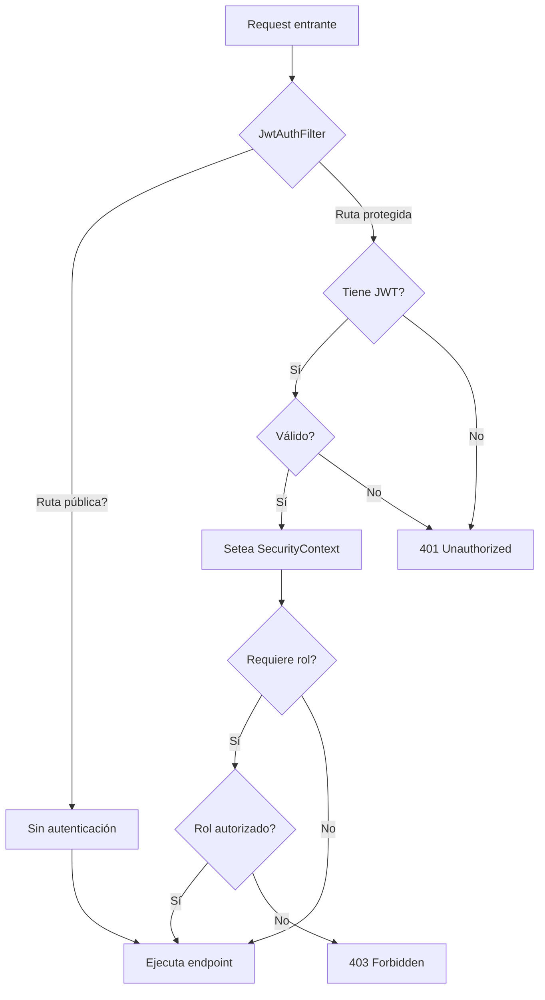

# Backend - Infrastructure

## DNA (Document Metadata)

| Field | Value |
|-------|-------|
| **Jira** | TBD |
| **Status** | Draft |
| **Author** | Pablo Garay |
| **Date** | 2026-05-16 |
| **Stakeholders** | Equipo TPI |
| **Version** | 0.1 |

---

## 1. Problem Statement

El backend actual no existe. Necesitamos establecer toda la infraestructura base sobre la cual se construirán los módulos de negocio: categorías, usuarios, productos y pedidos. Sin esta base, cualquier desarrollo queda en el aire.

Esta infraestructura incluye:
- Entidad base con soft delete y auditoría
- Repositorio base con filtro de eliminados
- Manejo global de excepciones
- Encriptación de contraseñas (BCrypt)
- Carga inicial de datos (seed)
- Documentación OpenAPI / Swagger
- Configuración CORS
- **Capa de seguridad JWT**: provider, filtro, configuración de rutas protegidas
- **Sistema de autorización por roles** vía enum + custom annotation

---

## 2. Context & Background

- **Stack**: Java 17, Spring Boot 3.x, PostgreSQL, Gradle
- **Frontend**: TypeScript + Vite (consumirá esta API)
- **Autenticación**: JWT stateless con filtro por request
- **Arquitectura**: Capas (Controller → Service → Repository)
- **Base de datos**: PostgreSQL vía Spring Data JPA + Hibernate

---

## 3. Goals & Success Metrics

### Primary Goal
Establecer la infraestructura base del backend para que cualquier módulo de negocio pueda construirse sin repetir configuración.

### Success Metrics

| Metric | Current | Target | How to Measure |
|--------|---------|--------|----------------|
| Tiempo de setup de nuevo CRUD | N/A | < 15 min | Tiempo para crear Entity + Service + Controller nuevos |
| Cobertura de exceptions | 0% | 100% | Todos los errores HTTP tienen handler |
| Endpoints documentados | 0% | 100% | Swagger accesible en /swagger-ui/index.html |

---

## 4. Target Users

### Primary User
- **Role**: Backend Developer
- **Need**: Infraestructura reutilizable para construir features
- **Frequency**: Cada vez que se agrega un módulo nuevo

### Secondary Users
- Frontend developer: necesita API documentada y CORS habilitado
- Admin: necesita seed data para probar

---

## 5. User Stories

### US-01 (HU-023): Entidad Base
**As a** backend developer
**I want** una clase base abstracta con id, timestamps, soft delete y optimistic locking
**So that** todas las entidades hereden comportamiento común sin repetir código

**Acceptance Criteria:**
- [ ] Clase abstracta `Base` con `@MappedSuperclass`
- [ ] `id: Long` con `@Id` y `@GeneratedValue(IDENTITY)`
- [ ] `eliminado: boolean` con `@Builder.Default = false`
- [ ] `createdAt: LocalDateTime` con `@CreationTimestamp`
- [ ] `updatedAt: LocalDateTime` con `@UpdateTimestamp`
- [ ] `version: Long` con `@Version` (optimistic locking)
- [ ] `@SuperBuilder` para herencia de builders
- [ ] Todos los tests unitarios pasan

### US-02 (HU-024): Repositorio Base
**As a** backend developer
**I want** un repositorio base que filtre automáticamente registros eliminados
**So that** no tenga que repetir `WHERE eliminado = false` en cada query

**Acceptance Criteria:**
- [ ] Interfaz `BaseRepository<E extends Base, ID>` extiende `JpaRepository`
- [ ] Override `findAll()` que filtra `eliminado = false`
- [ ] Método `findByIdOrThrow(id)` lanza `ResourceNotFoundException`
- [ ] `deleteById()` implementa soft delete (setea `eliminado = true`)
- [ ] `@Transactional` y `@Modifying` en soft delete
- [ ] Tests unitarios y de integración

### US-03 (HU-025): Manejo Global de Excepciones
**As a** frontend developer
**I want** respuestas de error consistentes con código HTTP adecuado
**So that** pueda manejar errores de forma predecible

**Acceptance Criteria:**
- [ ] `GlobalExceptionHandler` con `@RestControllerAdvice`
- [ ] `ResourceNotFoundException` → 404
- [ ] `BusinessException` (validaciones de negocio) → 400
- [ ] `MethodArgumentNotValidException` → 400 con detalle por campo
- [ ] `AccessDeniedException` → 403
- [ ] `IllegalStateException` → 409 Conflict
- [ ] `Exception` genérica → 500 Internal Server Error
- [ ] Formato de respuesta: `{ "error": "codigo", "message": "descripcion", "status": 400 }`
- [ ] Tests para cada tipo de excepción

### US-04 (HU-026): Encriptación de Contraseñas
**As a** security concern
**I want** las contraseñas almacenadas con BCrypt
**So that** no se guarden en texto plano

**Acceptance Criteria:**
- [ ] Bean `PasswordEncoder` con BCrypt en `SecurityConfig`
- [ ] `encode(String rawPassword)` → hash
- [ ] `matches(String rawPassword, String encodedPassword)` → boolean
- [ ] Tests unitarios de encoding y matching

### US-05: JWT - Provider y Token
**As a** backend developer
**I want** un provider que genere y valide tokens JWT
**So that** la autenticación sea stateless y segura

**Acceptance Criteria:**
- [ ] `JwtProvider` con método `generateToken(userId, email, role)`
- [ ] `validateToken(token)` → boolean
- [ ] `getUserIdFromToken(token)` → Long
- [ ] `getRoleFromToken(token)` → String
- [ ] Configuración de secret key y expiration via `application.properties`
- [ ] Tests unitarios de generación y validación
- [ ] Token incluye: sub (userId), email, role, iat, exp

### US-06: JWT - Filtro de Autenticación
**As a** backend developer
**I want** un filtro que intercepte cada request y valide el JWT
**So that** las rutas protegidas requieran token válido

**Acceptance Criteria:**
- [ ] `JwtAuthFilter extends OncePerRequestFilter`
- [ ] Extrae token del header `Authorization: Bearer <token>`
- [ ] Valida token con `JwtProvider`
- [ ] Setea `SecurityContextHolder` con authentication
- [ ] Omite rutas públicas: `/api/auth/login`, `/api/auth/register`
- [ ] Responde 401 si token inválido o ausente
- [ ] Tests de integración

### US-07: JWT - SecurityConfig y Roles
**As a** backend developer
**I want** configuración centralizada de seguridad
**So that** pueda definir qué roles acceden a qué rutas

**Acceptance Criteria:**
- [ ] `SecurityConfig` con `@EnableWebSecurity` y `@EnableMethodSecurity`
- [ ] `SecurityFilterChain` con:
  - Rutas públicas: `/api/auth/**`, `/swagger-ui/**`, `/api-docs/**`
  - Rutas de admin: `/api/admin/**` requiere rol ADMIN
  - Rutas autenticadas: todo lo demás requiere autenticación
- [ ] Deshabilitar CSRF (API stateless)
- [ ] Session management: STATELESS
- [ ] `AuthenticationEntryPoint` para 401 personalizado
- [ ] Tests de integración por ruta pública/protegida/admin

### US-08 (HU-027): Carga Inicial de Datos (Seed)
**As a** developer
**I want** datos iniciales cargados automáticamente al iniciar la app
**So that** pueda probar sin tener que registrar usuarios manualmente

**Acceptance Criteria:**
- [ ] `DataLoader implements CommandLineRunner`
- [ ] Si no hay usuarios, crea admin por defecto:
  - Email: `admin@admin.com`
  - Password: `123456` (encriptado con BCrypt)
  - Rol: `ADMIN`
- [ ] Si ya hay datos, no duplica
- [ ] Log de confirmación al iniciar

### US-09 (HU-028): OpenAPI / Swagger
**As a** frontend developer
**I want** documentación interactiva de la API
**So that** pueda explorar endpoints sin leer código

**Acceptance Criteria:**
- [ ] Dependencia `springdoc-openapi-starter-webmvc-ui`
- [ ] Swagger UI en `/swagger-ui/index.html`
- [ ] Especificación OpenAPI en `/api-docs`
- [ ] Bearer token configurado en Swagger para endpoints protegidos
- [ ] Descripción y versión de la API configurada

### US-10 (HU-029): CORS
**As a** frontend developer
**I want** CORS configurado para development
**So that** el frontend en Vite pueda llamar a la API

**Acceptance Criteria:**
- [ ] Configuración CORS en `SecurityConfig` o `WebMvcConfigurer`
- [ ] Permitir origen: `http://localhost:5173` (Vite dev)
- [ ] Permitir métodos: GET, POST, PUT, DELETE, PATCH, OPTIONS
- [ ] Permitir headers: Authorization, Content-Type
- [ ] Permitir credentials: true

---

## 6. Functional Requirements

### FR-01: Base Entity (HU-023)
Clase abstracta `Base` con `@MappedSuperclass`, `@SuperBuilder` y los campos: id, eliminado, createdAt, updatedAt, version.

### FR-02: Base Repository (HU-024)
`BaseRepository<E, ID>` que extiende `JpaRepository` con soft delete automático.

### FR-03: Exception Handler (HU-025)
Manejo centralizado de todas las excepciones con `@RestControllerAdvice`.

### FR-04: Password Encoder (HU-026)
Bean `PasswordEncoder` con BCrypt en la configuración de seguridad.

### FR-05: JWT Provider
Generación y validación de tokens JWT con claims: userId, email, role.

### FR-06: JWT Filter
Filtro que intercepta requests, extrae y valida JWT, setea contexto de seguridad.

### FR-07: Security Configuration
`SecurityFilterChain` con rutas públicas, protegidas y por rol. Stateless sessions.

### FR-08: Data Loader (HU-027)
`CommandLineRunner` que crea admin por defecto si no existe.

### FR-09: OpenAPI (HU-028)
SpringDoc OpenAPI con Swagger UI y configuración Bearer JWT.

### FR-10: CORS (HU-029)
Configuración CORS para desarrollo local.

---

## 7. Non-Functional Requirements

| Category | Requirement ID | Requirement |
|----------|----------------|-------------|
| **Security** | NFR-01 | Todos los endpoints protegidos por JWT excepto `/api/auth/**` |
| **Security** | NFR-02 | Contraseñas encriptadas con BCrypt (fortaleza 10+) |
| **Security** | NFR-03 | JWT con expiration de 24 horas |
| **Security** | NFR-04 | CSRF deshabilitado, sesiones STATELESS |
| **Performance** | NFR-05 | Validación de JWT en < 10ms por request |
| **Compatibility** | NFR-06 | API versionada bajo `/api/v1/` |

---

## 8. User Flow



---

## 9. API / Interface Contracts

### JWT Token Response
```json
{
  "token": "eyJhbGciOiJIUzI1NiJ9...",
  "type": "Bearer",
  "id": 1,
  "email": "admin@admin.com",
  "role": "ADMIN"
}
```

### Error Response (consistente en toda la API)
```json
{
  "error": "resource_not_found",
  "message": "Usuario con id 999 no encontrado",
  "status": 404,
  "timestamp": "2026-05-16T12:00:00",
  "path": "/api/v1/usuarios/999"
}
```

### Validation Error Response
```json
{
  "error": "validation_error",
  "message": "Error de validación",
  "status": 400,
  "timestamp": "2026-05-16T12:00:00",
  "path": "/api/v1/categorias",
  "fields": {
    "nombre": "El nombre es obligatorio"
  }
}
```

---

## 10. Data Model

No hay tablas nuevas en este PRD (es infraestructura). Define:
- `Base` como clase `@MappedSuperclass` (no genera tabla)
- `application.properties` con conexión a PostgreSQL
- Tabla `usuarios` es responsabilidad de `back-users`

### application.properties (base)
```properties
spring.datasource.url=jdbc:postgresql://localhost:5432/foodstore
spring.datasource.username=postgres
spring.datasource.password=postgres
spring.jpa.hibernate.ddl-auto=update
spring.jpa.show-sql=false

app.jwt.secret=clave-secreta-muy-larga-para-jwt-hs256-al-menos-256-bits
app.jwt.expiration=86400000

springdoc.api-docs.path=/api-docs
springdoc.swagger-ui.path=/swagger-ui/index.html
```

---

## 11. DoD (Definition of Done)

### Testing
- [ ] Tests unitarios para `JwtProvider` (generación, validación, claims)
- [ ] Tests de integración para `JwtAuthFilter` (token válido, inválido, ausente)
- [ ] Tests de integración para rutas públicas vs protegidas
- [ ] Tests de autorización (admin puede, client no puede)
- [ ] Tests de `BaseRepository`: soft delete, findAll filtrado
- [ ] Tests de `GlobalExceptionHandler`: cada excepción retorna HTTP correcto
- [ ] Tests de `PasswordEncoder`: encode y matches
- [ ] Cobertura mínima: 80% en clases de infraestructura

### Código
- [ ] Compila sin errores ni warnings
- [ ] Sigue la estructura de capas: config / security / exception / model
- [ ] JWT configurado via properties, no hardcodeado
- [ ] Logs informativos en puntos clave

---

## 12. Out of Scope

- Refresh tokens (sesión única por token)
- Rate limiting
- HTTPS (se asume proxy reverso en producción)
- Multi-tenancy
- Audit logging de acciones de usuario (solo timestamps)

---

## 13. Dependencies

| Dependency | Type | Status | 
|------------|------|--------|
| Java 17+ | Tool | Available |
| Spring Boot 3.x | Lib | Available |
| PostgreSQL | Tool | Needs install |
| `spring-boot-starter-security` | Lib | Available |
| `io.jsonwebtoken:jjwt` | Lib | Available |
| `springdoc-openapi-starter-webmvc-ui` | Lib | Available |
| Gradle | Tool | Available |

---

## 14. Risks & Mitigations

| Risk ID | Risk | Probability | Impact | Mitigation |
|---------|------|-------------|--------|------------|
| R-01 | JWT secret hardcodeado en código | Medium | High | Config en application.properties, no en código |
| R-02 | PostgreSQL no disponible | Low | High | Usar H2 en development como fallback |
| R-03 | Soft delete no consistente en queries | Medium | Medium | Tests que verifiquen que findAll() filtra correctamente |

---

## Changelog

| Version | Date | Author | Changes |
|---------|------|--------|---------|
| 0.1 | 2026-05-16 | Pablo Garay | Initial draft |
