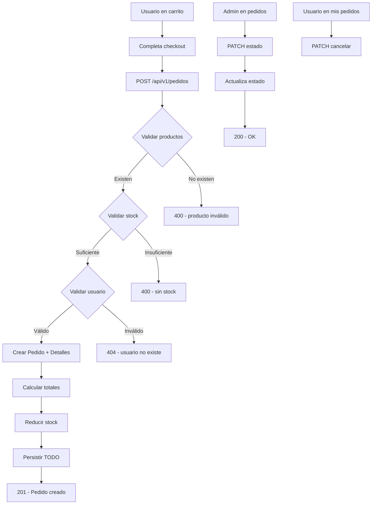

# Backend - Orders

## DNA (Document Metadata)

| Field | Value |
|-------|-------|
| **Jira** | TBD |
| **Status** | Draft |
| **Author** | Pablo Garay |
| **Date** | 2026-05-16 |
| **Stakeholders** | Equipo TPI |
| **Version** | 0.1 |

---

## 1. Problem Statement

El sistema debe permitir a los usuarios realizar pedidos con productos seleccionados del catálogo. Un pedido contiene múltiples detalles (snapshot del producto al momento de la compra), calcula totales automáticamente, reduce el stock al confirmarse y permite seguimiento de estado (PENDIENTE → CONFIRMADO → TERMINADO → CANCELADO). Todo debe ser transaccional para garantizar consistencia.

---

## 2. Context & Background

- **Depende de**: back-infrastructure, back-users, back-products
- **Snapshot**: los DetallePedido copian nombre, precio, descripción e imagen del producto al momento de la compra. Si el producto se modifica después, el pedido histórico conserva los datos originales.
- **Transaccional**: toda la operación de creación de pedido es atómica
- **Stock**: se reduce al crear el pedido. Si no hay stock, se rechaza.
- **Estados**: PENDIENTE → CONFIRMADO → TERMINADO → CANCELADO
- **Admin**: puede ver todos los pedidos y actualizar estados
- **Usuario**: puede ver solo sus pedidos y cancelar los que estén PENDIENTE
- **Forma de pago**: TARJETA, TRANSFERENCIA, EFECTIVO

---

## 3. Goals & Success Metrics

### Primary Goal
Sistema de pedidos transaccional con snapshot de productos, control de stock y seguimiento de estados.

---

## 4. Target Users

- **Cliente**: crea pedidos desde el carrito, ve su historial, cancela pedidos pendientes
- **Administrador**: gestiona estados de todos los pedidos

---

## 5. User Stories

### US-01 (HU-017): Crear Pedido
**As a** Usuario registrado
**I want** crear un pedido con los productos del carrito
**So that** realizar una compra

**Acceptance Criteria:**
- [ ] POST `/api/v1/pedidos` con token → 201
- [ ] Usuario debe existir → 404
- [ ] Al menos un detalle → 400 "Debe haber al menos un producto"
- [ ] Cada producto debe existir → 400
- [ ] Cada producto debe estar disponible → 400
- [ ] Cada producto debe tener stock suficiente → 400
- [ ] Cantidad debe ser >= 1 → 400
- [ ] Forma de pago requerida → 400
- [ ] Estado se setea automáticamente a PENDIENTE
- [ ] Fecha se setea automáticamente
- [ ] Subtotales se calculan: precio * cantidad
- [ ] Total se calcula: suma de subtotales
- [ ] Stock se reduce por cada producto
- [ ] TODO transaccional: si algo falla, rollback completo
- [ ] DetallePedido guarda snapshot: nombre, precio, descripción, imagen del producto

**Request:**
```json
{
  "formaPago": "TARJETA",
  "detalles": [
    {
      "idProducto": 1,
      "cantidad": 2
    },
    {
      "idProducto": 3,
      "cantidad": 1
    }
  ]
}
```

**Response 201:**
```json
{
  "id": 1,
  "fecha": "2026-05-16T12:00:00",
  "estado": "PENDIENTE",
  "formaPago": "TARJETA",
  "total": 70000.00,
  "usuario": {
    "id": 2,
    "nombre": "Juan",
    "email": "juan@email.com"
  },
  "detalles": [
    {
      "id": 1,
      "productoNombre": "Hamburguesa Triple",
      "productoPrecio": 25000.00,
      "productoDescripcion": "Triple carne...",
      "productoImagen": "https://...",
      "cantidad": 2,
      "subtotal": 50000.00
    },
    {
      "id": 2,
      "productoNombre": "Pizza Muzzarella",
      "productoPrecio": 18000.00,
      "productoDescripcion": "Salsa casera...",
      "productoImagen": "https://...",
      "cantidad": 1,
      "subtotal": 18000.00
    }
  ]
}
```

### US-02 (HU-018): Listar Pedidos (Admin)
**As a** Administrador
**I want** ver todos los pedidos del sistema
**So that** gestionar las órdenes

**Acceptance Criteria:**
- [ ] GET `/api/v1/pedidos` con token ADMIN → 200
- [ ] Todos los pedidos (no solo del usuario logueado)
- [ ] Incluye detalles
- [ ] Ordenados por fecha descendente (más recientes primero)
- [ ] Sin ADMIN → 403

### US-03 (HU-019): Obtener Pedido por ID
**As a** Usuario del sistema
**I want** ver detalle de un pedido específico
**So that** conocer su información

**Acceptance Criteria:**
- [ ] GET `/api/v1/pedidos/1` → 200 con datos completos
- [ ] Admin puede ver cualquier pedido
- [ ] Usuario solo puede ver sus propios pedidos → 403
- [ ] ID no existe → 404

### US-04 (HU-020): Listar Pedidos por Usuario
**As a** Usuario registrado
**I want** ver el historial de mis pedidos
**So that** hacer seguimiento de mis compras

**Acceptance Criteria:**
- [ ] GET `/api/v1/pedidos/usuario` → 200 con pedidos del usuario logueado
- [ ] Solo pedidos activos (no eliminados)
- [ ] Ordenados por fecha descendente
- [ ] Lista vacía → 200 con `[]`

### US-05 (HU-021): Actualizar Estado del Pedido
**As a** Administrador
**I want** cambiar el estado de un pedido
**So that** reflejar el progreso de la orden

**Acceptance Criteria:**
- [ ] PATCH `/api/v1/pedidos/1/estado` con token ADMIN → 200
- [ ] Solo ADMIN puede cambiar estado
- [ ] Estado válido requerido
- [ ] ID no existe → 404
- [ ] Sin ADMIN → 403

**Request:**
```json
{
  "estado": "CONFIRMADO"
}
```

### US-06 (HU-022): Cancelar Pedido (Usuario)
**As a** Usuario
**I want** cancelar mi pedido si está pendiente
**So that** no perder dinero si cambié de opinión

**Acceptance Criteria:**
- [ ] PATCH `/api/v1/pedidos/1/cancelar` con token → 200
- [ ] Solo el dueño del pedido puede cancelar
- [ ] Solo si estado es PENDIENTE → 400 si no
- [ ] Al cancelar: estado → CANCELADO, stock se restaura
- [ ] ID no existe → 404
- [ ] No dueño del pedido → 403

---

## 6. Functional Requirements

### FR-01: Endpoints
- POST `/api/v1/pedidos` — crear (USUARIO autenticado)
- GET `/api/v1/pedidos` — listar todos (ADMIN)
- GET `/api/v1/pedidos/{id}` — obtener por ID (dueño o ADMIN)
- GET `/api/v1/pedidos/usuario` — pedidos del usuario logueado (autenticado)
- PATCH `/api/v1/pedidos/{id}/estado` — cambiar estado (ADMIN)
- PATCH `/api/v1/pedidos/{id}/cancelar` — cancelar (dueño del pedido, solo PENDIENTE)

### FR-02: Snapshot de Productos
`DetallePedido` almacena:
- `productoNombre` — copia del nombre al momento de la compra
- `productoPrecio` — copia del precio
- `productoDescripcion` — copia de la descripción
- `productoImagen` — copia de la imagen
- `cantidad` — cantidad comprada
- `subtotal` — precio * cantidad

### FR-03: Control de Stock
- Validar stock disponible antes de crear
- Reducir stock al crear pedido
- Restaurar stock al cancelar (solo si estado era PENDIENTE)
- Si no hay stock suficiente → 400 con detalle del producto

### FR-04: Transaccionalidad
- `@Transactional` en creación de pedido
- Si alguna validación falla, rollback completo
- Si falla reducción de stock, rollback

### FR-05: Estados (enum)
PENDIENTE → CONFIRMADO → TERMINADO → CANCELADO
- Solo ADMIN avanza de PENDIENTE a CONFIRMADO o TERMINADO
- Usuario puede cancelar solo si está PENDIENTE
- Admin puede cancelar en cualquier estado

### FR-06: Forma de Pago (enum)
TARJETA, TRANSFERENCIA, EFECTIVO

---

## 7. Non-Functional Requirements

| Category | ID | Requirement |
|----------|--------|-------------|
| **Consistencia** | NFR-01 | Transaccional: todo o nada |
| **Concurrencia** | NFR-02 | Optimistic locking (@Version) evita race conditions en stock |
| **Rendimiento** | NFR-03 | Creación de pedido < 1 segundo |

---

## 8. User Flow


    T --> U{Es PENDIENTE?}
    U -->|Sí| V[Cancelar + restaurar stock]
    U -->|No| W[400 - no se puede cancelar]
```

---

## 9. API / Interface Contracts

### POST `/api/v1/pedidos`
**Request:**
```json
{
  "formaPago": "TARJETA | TRANSFERENCIA | EFECTIVO",
  "detalles": [
    {
      "idProducto": "long (obligatorio)",
      "cantidad": "integer (obligatorio, >= 1)"
    }
  ]
}
```

**Response 201:** (ver structure arriba)

### PATCH `/api/v1/pedidos/{id}/estado`
**Request:**
```json
{
  "estado": "CONFIRMADO | TERMINADO | CANCELADO"
}
```

**Response 200:** Pedido actualizado.

### PATCH `/api/v1/pedidos/{id}/cancelar`
**Response 200:** Pedido cancelado + stock restaurado.

---

## 10. Data Model

### Pedido (extiende Base)

| Campo | Tipo | Constraint | Descripción |
|-------|------|------------|-------------|
| id | Long | PK, auto | Heredado |
| fecha | LocalDateTime | NOT NULL, auto | Fecha del pedido |
| estado | Estado | NOT NULL | PENDIENTE / CONFIRMADO / TERMINADO / CANCELADO |
| formaPago | FormaPago | NOT NULL | TARJETA / TRANSFERENCIA / EFECTIVO |
| total | BigDecimal | NOT NULL | Suma de subtotales |
| usuario | ManyToOne | NOT NULL | Usuario que hizo el pedido |
| detalles | OneToMany | Cascade ALL | Detalles del pedido |

### DetallePedido (extiende Base)

| Campo | Tipo | Constraint | Descripción |
|-------|------|------------|-------------|
| id | Long | PK, auto | Heredado |
| productoNombre | String | NOT NULL | Snapshot: nombre al comprar |
| productoPrecio | BigDecimal | NOT NULL | Snapshot: precio al comprar |
| productoDescripcion | String | nullable | Snapshot: descripción al comprar |
| productoImagen | String | nullable | Snapshot: imagen al comprar |
| cantidad | Integer | NOT NULL, >= 1 | Cantidad comprada |
| subtotal | BigDecimal | NOT NULL | precio * cantidad |
| pedido | ManyToOne | NOT NULL | Pedido al que pertenece |

### Enums

```java
public enum Estado {
    PENDIENTE, CONFIRMADO, TERMINADO, CANCELADO
}

public enum FormaPago {
    TARJETA, TRANSFERENCIA, EFECTIVO
}
```

### Relaciones
- `Pedido` M:1 `Usuario` (un usuario tiene muchos pedidos)
- `Pedido` 1:N `DetallePedido` (cascade ALL, orphan removal)
- `DetallePedido` NO tiene relación directa con `Producto` (es snapshot)

---

## 11. DoD (Definition of Done)

### Testing
- [ ] Tests: crear pedido exitoso con todos los cálculos correctos
- [ ] Tests: stock se reduce correctamente
- [ ] Tests: producto sin stock → 400
- [ ] Tests: producto no disponible → 400
- [ ] Tests: producto no existe → 400
- [ ] Tests: cantidad 0 o negativa → 400
- [ ] Tests: transaccional (falla en medio → rollback, stock no se reduce)
- [ ] Tests: snapshot almacena datos correctos (cambiar producto después no afecta)
- [ ] Tests: admin cambia estado de pedido
- [ ] Tests: usuario cancela pedido PENDIENTE (stock se restaura)
- [ ] Tests: usuario no puede cancelar pedido CONFIRMADO
- [ ] Tests: usuario no puede ver pedidos de otro usuario
- [ ] Tests: admin puede ver todos los pedidos
- [ ] Tests de integración para todos los endpoints

### Código
- [ ] Entidades `Pedido` y `DetallePedido` con herencia de `Base`
- [ ] Enums `Estado` y `FormaPago`
- [ ] DTOs: `PedidoRequest`, `PedidoResponse`, `EstadoRequest`
- [ ] `PedidoService`: lógica transaccional, validaciones, stock
- [ ] `PedidoController` con todos los endpoints
- [ ] `@Transactional` en creación y cancelación
- [ ] `@PreAuthorize` en cada endpoint según rol
- [ ] BigDecimal para precios y totales

---

## 12. Out of Scope

- Restaurar stock al eliminar pedido (solo al cancelar)
- Notificaciones al cambiar estado
- Historial de cambios de estado
- Factura / comprobante

---

## 13. Dependencies

| Dependency | Type |
|------------|------|
| back-infrastructure | Internal |
| back-users | Internal (Usuario) |
| back-products | Internal (Producto para validación y stock) |

---

## 14. Risks & Mitigations

| Risk | Probability | Impact | Mitigation |
|------|-------------|--------|------------|
| Race condition en stock | Medium | High | @Version optimistic locking, @Transactional |
| Datos inconsistentes en snapshot | Low | High | Copiar datos al crear, no referenciar producto vivo |

---

## Changelog

| Version | Date | Author | Changes |
|---------|------|--------|---------|
| 0.1 | 2026-05-16 | Pablo Garay | Initial draft |
