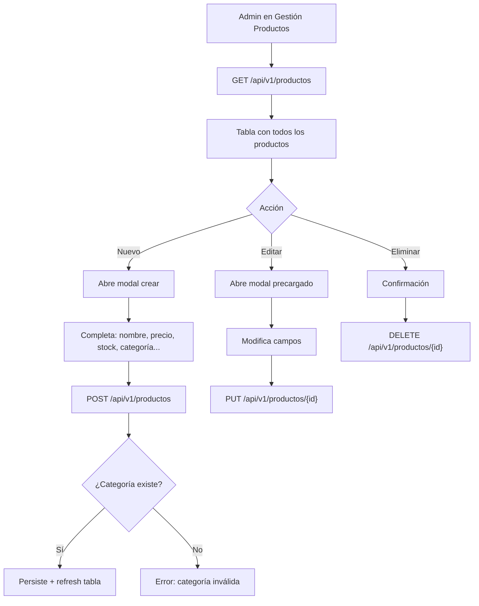

# Backend - Products

## DNA (Document Metadata)

| Field | Value |
|-------|-------|
| **Jira** | TBD |
| **Status** | Draft |
| **Author** | Pablo Garay |
| **Date** | 2026-05-16 |
| **Stakeholders** | Equipo TPI |
| **Version** | 0.1 |

---

## 1. Problem Statement

El sistema necesita gestionar un catálogo de productos. Cada producto pertenece a una categoría y tiene: nombre, precio, descripción, stock, imagen y disponibilidad. Los administradores gestionan el CRUD completo. Los clientes pueden visualizar productos activos y disponibles.

---

## 2. Context & Background

- **Depende de**: back-infrastructure, back-categories
- **Solo ADMIN** puede crear, modificar y eliminar productos
- **Usuarios autenticados** pueden listar y ver productos
- **Asociación obligatoria** a una categoría existente
- **Soft delete**: productos eliminados no se muestran
- **Stock**: control de inventario, se reduce al crear pedidos (via back-orders)

---

## 3. Goals & Success Metrics

### Primary Goal
CRUD completo de productos con validaciones, control de stock y asociación a categoría.

---

## 4. Target Users

- **Administrador**: gestiona el catálogo completo
- **Cliente**: visualiza productos en tienda

---

## 5. User Stories

### US-01 (HU-011): Crear Producto
**As a** Administrador
**I want** crear nuevos productos
**So that** ampliar el catálogo de la tienda

**Acceptance Criteria:**
- [ ] POST `/api/v1/productos` con token ADMIN → 201
- [ ] Nombre vacío → 400
- [ ] Precio ≤ 0.01 → 400
- [ ] Stock < 0 → 400
- [ ] Categoría no existe → 400
- [ ] Categoría eliminada → 400
- [ ] Sin ADMIN → 403
- [ ] Response incluye datos de la categoría anidada

**Request:**
```json
{
  "nombre": "Hamburguesa Triple",
  "precio": 25000.00,
  "descripcion": "Triple carne, cheddar y bacon",
  "stock": 50,
  "imagen": "https://ejemplo.com/hamburguesa.jpg",
  "disponible": true,
  "idCategoria": 1
}
```

**Response 201:**
```json
{
  "id": 1,
  "nombre": "Hamburguesa Triple",
  "precio": 25000.00,
  "descripcion": "Triple carne, cheddar y bacon",
  "stock": 50,
  "imagen": "https://ejemplo.com/hamburguesa.jpg",
  "disponible": true,
  "categoria": {
    "id": 1,
    "nombre": "Hamburguesas",
    "descripcion": "..."
  }
}
```

### US-02 (HU-012): Listar Productos
**As a** Usuario del sistema
**I want** ver todos los productos activos
**So that** elegir qué comprar

**Acceptance Criteria:**
- [ ] GET `/api/v1/productos` → 200 con productos + categoría anidada
- [ ] Solo productos con `eliminado = false`
- [ ] Incluye disponibles e indisponibles
- [ ] Lista vacía → 200 con `[]`

### US-03 (HU-013): Obtener Producto por ID
**As a** Usuario del sistema
**I want** ver detalle de un producto
**So that** conocer su información completa

**Acceptance Criteria:**
- [ ] GET `/api/v1/productos/1` → 200 con producto + categoría
- [ ] ID no existe → 404
- [ ] Producto eliminado → 404

### US-04 (HU-014): Listar Productos por Categoría
**As a** Usuario del sistema
**I want** filtrar productos por categoría
**So that** navegar el catálogo más fácilmente

**Acceptance Criteria:**
- [ ] GET `/api/v1/productos/categoria/1` → 200 con productos de esa categoría
- [ ] Categoría no existe → 404
- [ ] Solo retorna productos activos
- [ ] Incluye disponibles e indisponibles

### US-05 (HU-015): Actualizar Producto
**As a** Administrador
**I want** modificar un producto existente
**So that** mantener la información actualizada

**Acceptance Criteria:**
- [ ] PUT `/api/v1/productos/1` con token ADMIN → 200
- [ ] Actualización parcial
- [ ] Precio debe ser > 0.01 si se actualiza
- [ ] Stock debe ser >= 0 si se actualiza
- [ ] Si se cambia categoría, debe existir
- [ ] ID no existe → 404
- [ ] Sin ADMIN → 403

### US-06 (HU-016): Eliminar Producto (Soft Delete)
**As a** Administrador
**I want** eliminar un producto
**So that** mantener el catálogo actualizado

**Acceptance Criteria:**
- [ ] DELETE `/api/v1/productos/1` con token ADMIN → 204
- [ ] Soft delete
- [ ] Detalles de pedido históricos mantienen la snapshot del producto
- [ ] ID no existe → 404
- [ ] Sin ADMIN → 403

---

## 6. Functional Requirements

### FR-01: Endpoints
- POST `/api/v1/productos` — crear (ADMIN)
- GET `/api/v1/productos` — listar (autenticado)
- GET `/api/v1/productos/{id}` — obtener (autenticado)
- GET `/api/v1/productos/categoria/{id}` — por categoría (autenticado)
- PUT `/api/v1/productos/{id}` — actualizar (ADMIN)
- DELETE `/api/v1/productos/{id}` — eliminar (ADMIN)

### FR-02: Validaciones
- Nombre: obligatorio, 2-100 caracteres
- Precio: obligatorio, > 0.01 (BigDecimal)
- Stock: obligatorio, >= 0
- Categoría: obligatoria, debe existir y no estar eliminada
- Imagen: opcional, URL válida
- Disponible: opcional, default true

### FR-03: Reglas de Negocio
- Precio se almacena como BigDecimal para precisión
- Disponible indica si el producto está a la venta (no confundir con eliminado)
- Stock se reduce al confirmar pedidos (en back-orders)

---

## 7. Non-Functional Requirements

| Category | ID | Requirement |
|----------|--------|-------------|
| **Seguridad** | NFR-01 | Solo ADMIN modifica productos |
| **Precisión** | NFR-02 | Precio en BigDecimal, no double/float |
| **Integridad** | NFR-03 | Categoría debe existir al crear/actualizar |

---

## 8. User Flow



---

## 9. API / Interface Contracts

### POST `/api/v1/productos`
**Request:**
```json
{
  "nombre": "string (obligatorio, 2-100)",
  "precio": "number (obligatorio, > 0.01)",
  "descripcion": "string (opcional, máx 500)",
  "stock": "integer (obligatorio, >= 0)",
  "imagen": "string (opcional, URL)",
  "disponible": "boolean (opcional, default true)",
  "idCategoria": "long (obligatorio)"
}
```

**Response 201:**
```json
{
  "id": 1,
  "nombre": "Hamburguesa Triple",
  "precio": 25000.00,
  "descripcion": "...",
  "stock": 50,
  "imagen": "...",
  "disponible": true,
  "categoria": {
    "id": 1,
    "nombre": "Hamburguesas"
  }
}
```

### GET `/api/v1/productos`
**Response 200:**
```json
[
  {
    "id": 1,
    "nombre": "Hamburguesa Triple",
    "precio": 25000.00,
    "descripcion": "...",
    "stock": 50,
    "imagen": "...",
    "disponible": true,
    "categoria": {
      "id": 1,
      "nombre": "Hamburguesas"
    }
  }
]
```

---

## 10. Data Model

### Producto (extiende Base)

| Campo | Tipo | Constraint | Descripción |
|-------|------|------------|-------------|
| id | Long | PK, auto | Heredado |
| nombre | String | NOT NULL, 2-100 | Nombre del producto |
| precio | BigDecimal | NOT NULL, > 0.01 | Precio unitario |
| descripcion | String | nullable, máx 500 | Descripción |
| stock | Integer | NOT NULL, >= 0 | Stock disponible |
| imagen | String | nullable | URL de imagen |
| disponible | Boolean | NOT NULL, default true | Si está a la venta |
| categoria | ManyToOne | NOT NULL | Categoría asociada |

### Relaciones
- `Producto` N:1 `Categoria` (Muchos productos pertenecen a una categoría)
- Cascade: NONE (no eliminar productos al eliminar categoría)
- Fetch: LAZY

---

## 11. DoD (Definition of Done)

### Testing
- [ ] Tests unitarios: crear, listar, obtener, actualizar, eliminar producto
- [ ] Tests: precio menor o igual a 0.01 → 400
- [ ] Tests: stock negativo → 400
- [ ] Tests: categoría no existe → 400
- [ ] Tests: filtrar por categoría retorna solo productos de esa categoría
- [ ] Tests: soft delete (no aparece en listados, getById → 404)
- [ ] Tests: autorización ADMIN vs CLIENT
- [ ] Tests: actualización parcial
- [ ] Tests de integración para cada endpoint

### Código
- [ ] Entidad `Producto` con relación ManyToOne a `Categoria`
- [ ] DTOs: `ProductoRequest`, `ProductoResponse` (con categoría anidada)
- [ ] `ProductoService`: validaciones de stock, precio, categoría existente
- [ ] `ProductoController` con todos los endpoints
- [ ] BigDecimal para precisión de precios
- [ ] `@PreAuthorize` en endpoints de escritura

---

## 12. Out of Scope

- Imágenes upload (solo URL externa)
- Variantes de producto (talle, color)
- Descuentos / promociones

---

## 13. Dependencies

| Dependency | Type |
|------------|------|
| back-infrastructure | Internal |
| back-categories | Internal (Categoria entity) |

---

## Changelog

| Version | Date | Author | Changes |
|---------|------|--------|---------|
| 0.1 | 2026-05-16 | Pablo Garay | Initial draft |
