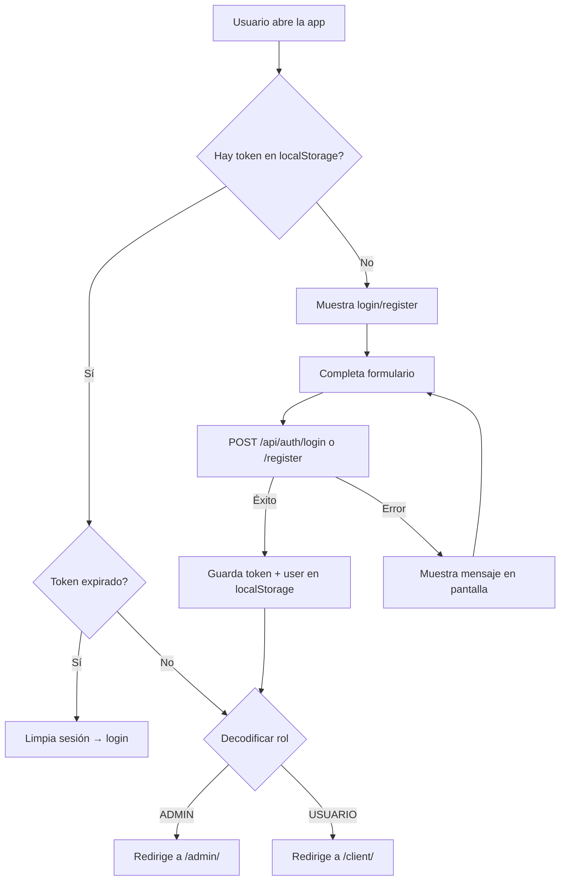

# Frontend - Auth

## DNA (Document Metadata)

| Field | Value |
|-------|-------|
| **Jira** | TBD |
| **Status** | Draft |
| **Author** | Pablo Garay |
| **Date** | 2026-05-16 |
| **Stakeholders** | Equipo TPI |
| **Version** | 0.1 |

---

## 1. Problem Statement

El frontend actual maneja autenticación contra localStorage. Las páginas de login y registro existen pero necesitan migrar a llamadas HTTP reales contra la API REST, almacenar el JWT retornado y usarlo en todas las requests subsecuentes.

---

## 2. Context & Background

- **Login** existe en `/src/pages/auth/login/` con validación local
- **Registro** existe en `/src/pages/auth/registro/` con validación local
- **auth.ts** tiene toda la lógica mockeada con localStorage
- **navigate.ts** tiene guards que verifican localStorage
- **Punto de entrada**: `main.ts` ejecuta `initRouteGuard()`

### Stack actual
- TypeScript + Vite
- Sin dependencias HTTP externas (fetch API nativo)
- localStorage para persistencia

---

## 3. Goals & Success Metrics

### Primary Goal
Migrar login y registro a usar la API REST real con JWT, manteniendo la misma experiencia de usuario.

---

## 4. Target Users

- **Visitante**: se registra
- **Usuario registrado**: inicia sesión

---

## 5. User Stories

### US-01: Login conectado a API
**As a** Usuario registrado
**I want** iniciar sesión con email y contraseña contra la API real
**So that** obtener un JWT válido

**Acceptance Criteria:**
- [ ] Login envía POST `/api/auth/login` con email + password
- [ ] En `form.submit`, no `alert()` sino spinner + feedback visual
- [ ] Éxito → guarda token y userData en localStorage → redirige según rol
- [ ] Error 401 → muestra mensaje "Email o contraseña inválidos" sin revelar detalle
- [ ] Error 400 → muestra validación del campo específico
- [ ] Error 500 → muestra "Error del servidor, intentá de nuevo"
- [ ] Si ya hay sesión activa con token válido, redirige automáticamente

### US-02: Registro conectado a API
**As a** Visitante
**I want** registrarme contra la API real
**So that** crear mi cuenta

**Acceptance Criteria:**
- [ ] Registro envía POST `/api/auth/register` con nombre, apellido, email, password
- [ ] Éxito → guarda token y userData → redirige a panel de cliente
- [ ] Error 400 (email duplicado) → muestra "El email ya está registrado"
- [ ] Error 400 (validación) → muestra el campo específico
- [ ] Incluir campo `nombre` y `apellido` en el formulario (actualmente solo tiene email/password)
- [ ] Incluir campo opcional `celular`

### US-03: Cliente HTTP con JWT
**As a** Frontend developer
**I want** un cliente HTTP que automaticamente incluya el JWT en todas las requests
**So that** no tener que agregar el header manualmente en cada llamada

**Acceptance Criteria:**
- [ ] Función `api.get<T>(url)` incluye header `Authorization: Bearer <token>`
- [ ] Función `api.post<T>(url, body)` incluye header
- [ ] Función `api.put<T>(url, body)` incluye header
- [ ] Función `api.delete<T>(url)` incluye header
- [ ] Si el token expiró (401), limpia sesión y redirige a login
- [ ] Manejo genérico de errores HTTP con mensajes descriptivos

### US-04: Route Guard con JWT
**As a** Frontend developer
**I want** que el route guard verifique el token JWT (no solo localStorage)
**So that** mejorar la seguridad

**Acceptance Criteria:**
- [ ] `isAuthenticated()` verifica que token exista en localStorage
- [ ] Al cargar página protegida, valida que token no esté expirado (decodificar payload)
- [ ] Si expirado, limpia sesión y redirige a login
- [ ] Guard por rol: admin solo accede a /admin/, client a /client/

---

## 6. Functional Requirements

### FR-01: api.ts (Cliente HTTP)
```typescript
// Interfaz base
export const api = {
  get<T>(endpoint: string): Promise<T>
  post<T>(endpoint: string, body: unknown): Promise<T>
  put<T>(endpoint: string, body: unknown): Promise<T>
  delete<T>(endpoint: string): Promise<T>
}

// En cada request:
// 1. Obtener token de localStorage
// 2. Agregar header Authorization: Bearer <token>
// 3. Si response es 401, limpiar sesión y redirigir a login
// 4. Si response es error, lanzar excepción con mensaje
```

### FR-02: Login
- Formulario con email + password
- Validación client-side antes de enviar
- POST a `/api/auth/login`
- Guardar response (token + user) en localStorage
- Redirigir según rol

### FR-03: Register
- Formulario con nombre, apellido, email, celular (opcional), password, confirmar password
- Solo registra como USUARIO
- POST a `/api/auth/register`
- Auto-login: guardar token + redirigir

### FR-04: Logout
- Limpiar localStorage (token, userData)
- Redirigir a login

### FR-05: Sesión Persistente
- Al cargar la app, verificar si hay token en localStorage
- Si hay token, decodificar payload para verificar expiración
- Si expirado, limpiar y redirigir a login
- Si válido, mantener sesión

---

## 7. User Flow



---

## 8. API / Interface Contracts

### POST `/api/auth/login`
**Request:**
```json
{
  "email": "string",
  "password": "string"
}
```

**Response 200:**
```json
{
  "token": "string",
  "type": "Bearer",
  "id": 1,
  "email": "admin@admin.com",
  "nombre": "Admin",
  "apellido": "Sistema",
  "celular": "1234567890",
  "role": "ADMIN"
}
```

### POST `/api/auth/register`
**Request:**
```json
{
  "nombre": "string",
  "apellido": "string",
  "email": "string",
  "celular": "string (opcional)",
  "password": "string"
}
```

**Response 201:** (misma estructura que login)

---

## 9. DoD (Definition of Done)

### Testing
- [ ] Login exitoso: verifica que se guarda token y redirige
- [ ] Login fallido: muestra mensaje de error
- [ ] Registro exitoso: crea usuario, guarda token, redirige
- [ ] Registro con email duplicado: muestra error
- [ ] Route guard: sin token redirige a login
- [ ] Route guard: token expirado redirige a login
- [ ] Route guard: client no puede entrar a /admin/
- [ ] Route guard: admin no puede entrar a /client/
- [ ] Logout: limpia localStorage y redirige

### Código
- [ ] `api.ts` creado con métodos get/post/put/delete + manejo JWT
- [ ] `auth.ts` refactorizado: todas las funciones usan api.ts
- [ ] `login.ts` refactorizado: POST real, spinner, manejo de errores
- [ ] `registro.ts` refactorizado: incluye nombre/apellido/celular
- [ ] `navigate.ts` actualizado: guard basado en JWT payload
- [ ] `main.ts` actualizado: verifica expiración al iniciar
- [ ] `types/` actualizados para alinear con DTOs del backend
- [ ] Sin `alert()` — reemplazar por feedback visual en pantalla

---

## 10. Out of Scope

- Refresh tokens
- 2FA
- OAuth social login

---

## 11. Dependencies

| Dependency | Type |
|------------|------|
| back-auth-jwt | Externa (API) |
| back-infrastructure | Externa (JWT) |

---

## Changelog

| Version | Date | Author | Changes |
|---------|------|--------|---------|
| 0.1 | 2026-05-16 | Pablo Garay | Initial draft |
