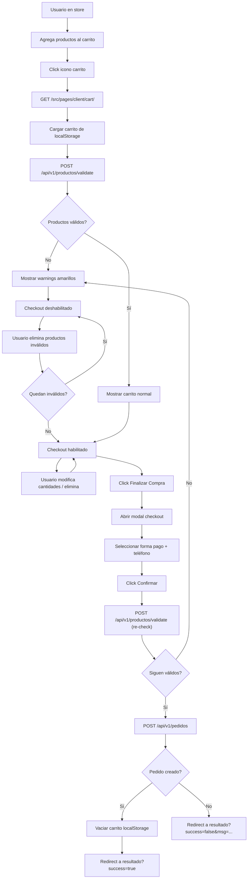

# Frontend - Cart & Checkout

## DNA (Document Metadata)

| Field | Value |
|-------|-------|
| **Jira** | TBD |
| **Status** | Draft |
| **Author** | Pablo Garay |
| **Date** | 2026-05-21 |
| **Stakeholders** | Equipo TPI |
| **Version** | 0.2 |

---

## 1. Problem Statement

Actualmente no existe una pantalla de carrito de compras. Los productos se agregan desde el catálogo (store) pero no hay forma de revisar, modificar cantidades, validar disponibilidad, o finalizar la compra. El checkout debe validar que los productos sigan existiendo, estén disponibles y tengan stock antes de crear el pedido.

---

## 2. Context & Background

- El carrito se eliminó de la página store para desacoplarlo en su propia vista
- Los productos se almacenan en localStorage bajo clave `cart` con estructura `[{ product: ProductoResponse, quantity: number }]`
- El catálogo ya usa datos de la API real con paginación
- El backend tiene endpoints de pedidos (`POST /api/v1/pedidos`) ya implementados
- Existe un PRD para pedidos del cliente: `docs/prd/front-client-orders.md`
- **No existe** un endpoint para validar productos en masa — hay que crearlo: `POST /api/v1/productos/validate`
- Las US-04 a US-06 del PRD `front-store.md` (Carrito Persistente, Gestión del Carrito, Checkout) se consolidan aquí
- El header (iconos, navegación) se maneja en PRD aparte: `docs/prd/front-header.md`

---

## 3. Goals & Success Metrics

### Primary Goal
Pantalla de carrito completa con validación de productos, gestión de items y checkout funcional.

---

## 4. Target Users

- **Cliente (USUARIO)**: revisa su carrito, modifica cantidades, elimina productos inválidos, finaliza la compra

---

## 5. User Stories

### US-01 (ex Store US-04): Carrito Persistente
**As a** Cliente
**I want** que mi carrito se guarde entre sesiones
**So that** no perder los productos seleccionados

**Acceptance Criteria:**
- [ ] Carrito se guarda en localStorage bajo clave `cart`
- [ ] Al agregar producto (desde store), se persiste inmediatamente
- [ ] Al recargar la página del carrito, se restaura desde localStorage
- [ ] Estructura: `[{ product: ProductoResponse, quantity: number }]`

### US-02 (ex Store US-05): Gestión del Carrito
**As a** Cliente
**I want** modificar cantidades y eliminar productos del carrito
**So that** ajustar mi pedido antes de comprar

**Acceptance Criteria:**
- [ ] Botón +/- para modificar cantidad (min 1, max stock)
- [ ] Botón eliminar individual por producto (funciona también para productos inválidos)
- [ ] Precio unitario y subtotal por producto
- [ ] Total general actualizado en tiempo real
- [ ] Botón "Vaciar Carrito" con confirmación
- [ ] Estado vacío: mensaje "No hay productos en el carrito" + botón "Ir a la tienda"

### US-03: Validación de productos al entrar al carrito
**As a** Cliente
**I want** que al entrar al carrito se validen todos los productos contra la API
**So that** saber si algún producto ya no existe, no está disponible o no tiene stock

**Acceptance Criteria:**
- [ ] Al cargar la página, se llama a `POST /api/v1/productos/validate` con los IDs del carrito
- [ ] Productos que no existen (hard delete): warning amarillo + "El producto no existe"
- [ ] Productos no disponibles (soft delete): warning amarillo + "El producto no está disponible"
- [ ] Productos sin stock: warning amarillo + "El producto está sin stock"
- [ ] Productos con problemas tienen background amarillo en la fila
- [ ] Si hay productos con problemas, el botón de checkout se deshabilita
- [ ] **Los productos inválidos también pueden eliminarse** (botón eliminar funciona)
- [ ] **Si se eliminan todos los productos inválidos, el checkout se re-habilita** (re-calcular flag)
- [ ] Los productos válidos pueden modificarse y eliminarse normalmente

### US-04 (ex Store US-06): Checkout
**As a** Cliente
**I want** confirmar mi pedido con forma de pago y teléfono
**So that** finalizar la compra

**Acceptance Criteria:**
- [ ] Botón "Finalizar Compra" en el resumen (columna derecha)
- [ ] Modal de checkout con: forma de pago (select) y teléfono (requerido)
- [ ] Forma de pago: TARJETA, TRANSFERENCIA, EFECTIVO
- [ ] Validación: teléfono requerido
- [ ] Al hacer click en "Confirmar", se re-valida contra la API (cubre cambios entre carga y checkout)
- [ ] Si la re-validación falla: se muestran los warnings y se bloquea el checkout
- [ ] Si pasa: `POST /api/v1/pedidos`
- [ ] Éxito: carrito se vacía + redirect a resultado
- [ ] Error (stock insuficiente): mostrar qué producto falló
- [ ] Durante el envío: spinner + botón deshabilitado

### US-05: Resultado del checkout
**As a** Cliente
**I want** saber si mi compra se procesó correctamente
**So that** saber el siguiente paso

**Acceptance Criteria:**
- [ ] Ruta: `/src/pages/client/checkout/resultado.html`
- [ ] Checkout exitoso (verde): muestra "¡Pedido confirmado!" + botón "Mis Pedidos"
- [ ] Checkout fallido (rojo): muestra "Error al procesar el pedido" + mensaje del error + botón "Volver al carrito"
- [ ] En caso de éxito, el carrito en localStorage se vacía automáticamente
- [ ] Loading state mientras se procesa

---

## 6. Functional Requirements

### FR-01: Cart persistence
- localStorage key: `cart`
- Formato: `CartItem[]` donde `CartItem { product: ProductoResponse, quantity: number }`
- Se persiste inmediatamente al agregar, modificar o eliminar items

### FR-02: Cart page layout
- Ruta: `/src/pages/client/cart/index.html`
- Layout: grid 2 columnas (productos | resumen)
- Columna izquierda: lista de productos con imagen, nombre, descripción, precio unitario, controles de cantidad (+/-), botón eliminar
- Columna derecha: resumen con subtotales, total general, botón "Vaciar Carrito", botón "Finalizar Compra"
- Estado vacío: mensaje + botón "Ir a la tienda"

### FR-03: Validación de productos
- `POST /api/v1/productos/validate` con body `{ ids: number[] }`
- Response: `{ validaciones: [{ id, existe, disponible, stock }] }`
- Warnings visuales: background amarillo + mensaje específico por fila
- Checkout bloqueado si hay warnings
- Al eliminar un producto inválido, se re-evalúa el flag de checkout bloqueado

### FR-04: Checkout modal
- Modal con: forma de pago (select: TARJETA, TRANSFERENCIA, EFECTIVO) y teléfono (input, requerido)
- Validación client-side: teléfono requerido
- Re-validación contra API antes de POST
- `POST /api/v1/pedidos` con body `{ formaPago, detalles: [{ idProducto, cantidad }] }`

### FR-05: Resultado del pedido
- Página independiente: `/src/pages/client/checkout/resultado.html`
- Recibe datos via query params (`?success=true/false&message=...`)
- Estado visual: verde (éxito) / rojo (error)
- Botón "Mis Pedidos" en éxito, "Volver al carrito" en error

---

## 7. User Flow



---

## 8. API / Interface Contracts

### POST `/api/v1/productos/validate` (NUEVO — Backend)
**Request:**
```json
{
  "ids": [1, 2, 3, 5]
}
```

**Response 200:**
```json
{
  "validaciones": [
    { "id": 1, "existe": true, "disponible": true, "stock": 10 },
    { "id": 2, "existe": true, "disponible": false, "stock": 0 },
    { "id": 3, "existe": false, "disponible": false, "stock": 0 },
    { "id": 5, "existe": true, "disponible": true, "stock": 0 }
  ]
}
```

### POST `/api/v1/pedidos` (ya existe)
**Request:**
```json
{
  "formaPago": "TARJETA",
  "detalles": [
    { "idProducto": 1, "cantidad": 2 },
    { "idProducto": 3, "cantidad": 1 }
  ]
}
```

**Response 201:**
```json
{
  "id": 1,
  "fecha": "2026-05-21T12:00:00",
  "estado": "PENDIENTE",
  "total": 70000.00,
  "detalles": [...]
}
```

---

## 9. Data Model (Frontend)

```typescript
// Carrito en localStorage
interface CartItem {
  product: ProductoResponse;
  quantity: number;
}

// Validación de producto
interface ProductoValidacion {
  id: number;
  existe: boolean;
  disponible: boolean;
  stock: number;
}

interface ValidateResponse {
  validaciones: ProductoValidacion[];
}

// Estado de validación por producto (frontend)
interface ProductoEstado {
  id: number;
  valido: boolean;
  mensaje: string;     // "" si es válido, mensaje de warning si no
}

// localStorage keys
const CART_KEY = 'cart';
```

---

## 10. UI/UX

### Cart page (2 columnas)
```
┌──────────────┬──────────────────────┐
│  Productos   │     Resumen          │
│              │                      │
│  [img] Prod1 │  Subtotal: $5000     │
│  Descripcion │  Total:   $15000     │
│  [-] 2 [+]   │                      │
│  [Eliminar]  │  [ Vaciar Carrito ]  │
│              │  [ Finalizar Compra ]│
│              │                      │
│  ⚠️ Prod2    │                      │
│  Sin stock   │                      │
│  [Eliminar]  │                      │
└──────────────┴──────────────────────┘
```

### Modal checkout
```
┌──────────────────────────┐
│  Finalizar Compra        │
│                          │
│  Forma de pago:          │
│  [ TARJETA  ▼]          │
│                          │
│  Teléfono:               │
│  [ ______________ ]      │
│                          │
│  Total: $15,000          │
│  [ Confirmar ] [Cancelar]│
└──────────────────────────┘
```

### Resultado
```
┌────────────────────────┐        ┌────────────────────────┐
│  ✅ Pedido Confirmado  │        │  ❌ Error al procesar  │
│                        │        │                        │
│  [ Mis Pedidos ]       │        │  [mensaje del error]   │
│                        │        │  [ Volver al carrito ] │
└────────────────────────┘        └────────────────────────┘
     (verde)                           (rojo)
```

---

## 11. Out of Scope

- Header / navegación (PRD separado: `front-header.md`)
- Cupones / descuentos
- Wishlist / favoritos
- Editar dirección de entrega
- Seleccionar método de envío
- Pantalla "Mis Pedidos" (PRD existente: `front-client-orders.md`)
- Invoice / resumen detallado post-checkout (US-06 de store, postergado)

---

## 12. Dependencies

| Dependency | Type | Status | Impact if Delayed |
|------------|------|--------|-------------------|
| `POST /api/v1/productos/validate` | Backend | ❌ Por implementar | **Bloqueante** |
| `POST /api/v1/pedidos` | External | ✅ Implementado | Usado en checkout |
| `front-auth` (JWT, api.ts) | Internal | ✅ Implementado | Base para todas las llamadas |
| `front-store` (tipos ProductoResponse) | Internal | ✅ Implementado | Tipos compartidos |
| `front-client-orders` | Internal | 📄 PRD exists | Link "Mis Pedidos" |
| `front-header` | Internal | 📄 A crear | Navegación al carrito |

---

## 13. Risks & Mitigations

| Risk ID | Risk | Probability | Impact | Mitigation |
|---------|------|-------------|--------|------------|
| R-01 | Producto cambia entre carga del carrito y checkout | Medium | High | Re-validar al clickear checkout |
| R-02 | Cart en localStorage se corrompe | Low | Medium | try/catch al parsear, limpiar si inválido |
| R-03 | Checkout queda bloqueado aunque ya no haya inválidos | Low | Medium | Recalcular flag cada vez que se elimina un item |

---

## Changelog

| Version | Date | Author | Changes |
|---------|------|--------|---------|
| 0.1 | 2026-05-21 | Pablo Garay | Initial draft |
| 0.2 | 2026-05-21 | Pablo Garay | Consolidación con Store US-04 a US-06, eliminado header (pasa a PRD propio), agregada lógica de eliminación de inválidos |

---

## Appendix

### A. Backend: Nuevo endpoint necesario

Crear en `ProductoController.java`:

```java
@PostMapping("/productos/validate")
public ResponseEntity<List<ProductoValidacionResponse>> validarProductos(
    @RequestBody @Valid ProductoValidarRequest request
) {
    // Para cada ID: buscar producto
    // Si no existe → { existe: false, disponible: false, stock: 0 }
    // Si existe pero eliminado (soft delete) → { existe: true, disponible: false, stock: 0 }
    // Si existe y no eliminado → { existe: true, disponible, stock }
}
```

```java
public record ProductoValidarRequest(
    @NotEmpty List<Long> ids
) {}

public record ProductoValidacionResponse(
    Long id,
    boolean existe,
    boolean disponible,
    int stock
) {}
```
