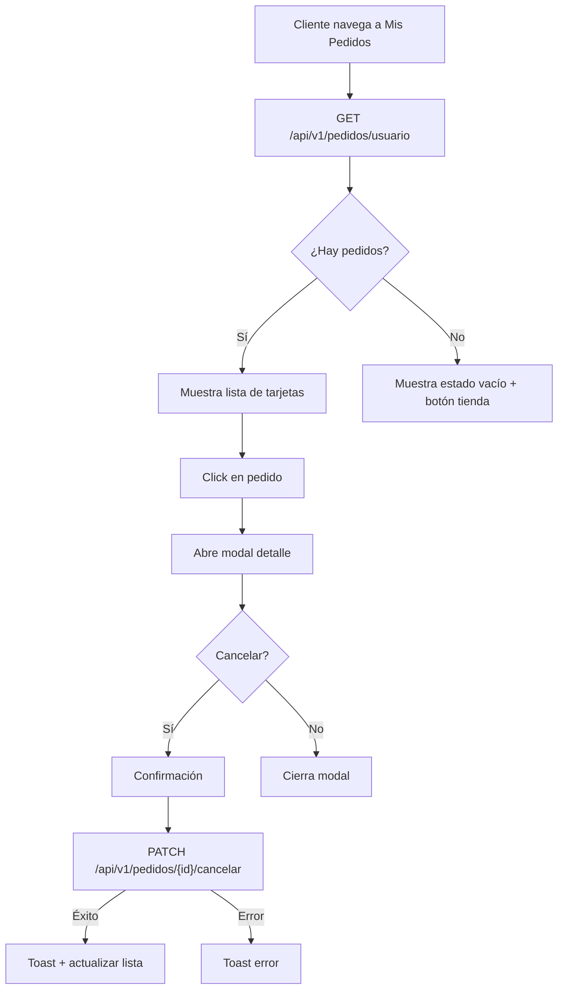

# Frontend - Client Orders

## DNA (Document Metadata)

| Field | Value |
|-------|-------|
| **Jira** | TBD |
| **Status** | Draft |
| **Author** | Pablo Garay |
| **Date** | 2026-05-16 |
| **Stakeholders** | Equipo TPI |
| **Version** | 0.2 |

---

## 1. Problem Statement

Los clientes necesitan poder ver el historial de sus pedidos, consultar el detalle de cada uno y conocer su estado actual. Actualmente no existe esta funcionalidad ni en frontend ni en backend.

---

## 2. Context & Background

- **Nueva página** en `/src/pages/client/orders/`
- **Ruta protegida**: solo usuarios autenticados con rol USUARIO
- **Datos desde API**: `GET /api/v1/pedidos/usuario`
- **Estados**: PENDIENTE, CONFIRMADO, TERMINADO, CANCELADO
- **Acciones**: solo cancelar pedidos en estado PENDIENTE

---

## 3. Goals

### Primary Goal
Página de historial de pedidos con listado, detalle y cancelación.

---

## 4. Target Users

- **Cliente (USUARIO)**: ve y gestiona sus pedidos

---

## 5. User Stories

### US-01: Listar Mis Pedidos con Paginación
**As a** Cliente
**I want** ver el historial de todos mis pedidos con paginación
**So that** hacer seguimiento de mis compras sin saturar la pantalla

**Acceptance Criteria:**
- [ ] `GET /api/v1/pedidos/usuario?page=0&size=10` → lista paginada de pedidos del usuario logueado
- [ ] Cada pedido muestra: número, fecha, estado con badge de color, resumen productos (primeros 3 + "y N más"), total
- [ ] Ordenados por fecha descendente (sort=fecha,desc)
- [ ] Controles de paginación: botones anterior/siguiente, selector de página
- [ ] Contador "Mostrando X-Y de Z pedidos"
- [ ] Selector de items por página: 5, 10, 20
- [ ] Estado vacío: mensaje "No tenés pedidos aún" + botón "Ir a la tienda"
- [ ] Loading spinner mientras carga
- [ ] Paginación deshabilitada si solo hay 1 página

**Colores de estado:**

| Estado | Color |
|--------|-------|
| PENDIENTE | 🟡 Amarillo |
| CONFIRMADO | 🔵 Azul |
| TERMINADO | 🟢 Verde |
| CANCELADO | 🔴 Rojo |

### US-02: Ver Detalle del Pedido
**As a** Cliente
**I want** ver el detalle completo de un pedido
**So that** conocer qué compré y cuánto pagué

**Acceptance Criteria:**
- [ ] Click en pedido abre modal con detalle completo
- [ ] `GET /api/v1/pedidos/{id}` para datos completos
- [ ] Modal muestra: estado con icono, fecha, forma de pago, teléfono
- [ ] Lista completa de productos: nombre, precio unitario, cantidad, subtotal
- [ ] Total general del pedido
- [ ] Botón "Cerrar" para volver al listado

### US-03: Cancelar Pedido
**As a** Cliente
**I want** cancelar un pedido si está pendiente
**So that** evitar que se procese si cambié de opinión

**Acceptance Criteria:**
- [ ] Botón "Cancelar" solo visible si estado es PENDIENTE
- [ ] Confirmación antes de cancelar (modal de confirmación)
- [ ] `PATCH /api/v1/pedidos/{id}/cancelar`
- [ ] Éxito: toast + actualizar lista
- [ ] Error: toast con mensaje
- [ ] Si otro admin ya cambió el estado, mostrar "El pedido ya no se puede cancelar"

---

## 6. Functional Requirements

### FR-01: Lista de Pedidos
- GET a API
- Tarjetas con resumen
- Badge de color según estado
- Limitado a pedidos del usuario autenticado

### FR-02: Modal de Detalle
- Datos completos del pedido
- Lista de productos con subtotales
- Estado con icono

### FR-03: Cancelación
- Solo visible en PENDIENTE
- Confirmación previa
- PATCH a API
- Feedback de éxito/error

---

## 7. User Flow


```

---

## 8. API / Interface Contracts

### GET `/api/v1/pedidos/usuario?page=0&size=10`
**Query Params:**
- `page`: número de página (0-indexed, default: 0)
- `size`: items por página (default: 20)
- `sort`: campo,dirección (default: `fecha,desc`)

**Response 200:**
```json
{
  "content": [
    {
      "id": 1,
      "fecha": "2026-05-16T12:00:00",
      "estado": "PENDIENTE",
      "formaPago": "TARJETA",
      "total": 70000.00,
      "detalles": [
        {
          "productoNombre": "Hamburguesa Triple",
          "productoPrecio": 25000.00,
          "cantidad": 2,
          "subtotal": 50000.00
        }
      ]
    }
  ],
  "page": 0,
  "size": 10,
  "totalElements": 23,
  "totalPages": 3
}
```

### PATCH `/api/v1/pedidos/{id}/cancelar`
**Response 200:**
```json
{
  "id": 1,
  "estado": "CANCELADO"
}
```

---

## 9. DoD (Definition of Done)

## 9. DoD (Definition of Done)

### Testing
- [ ] Lista carga y muestra pedidos correctamente con paginación
- [ ] Paginación: navegación entre páginas funciona
- [ ] Contador "Mostrando X-Y de Z pedidos" es preciso
- [ ] Selector de items por página (5, 10, 20) actualiza resultados
- [ ] Paginación se deshabilita si solo hay 1 página
- [ ] Estado vacío se muestra cuando no hay pedidos
- [ ] Modal detalle carga datos completos
- [ ] Cancelación funciona solo en estado PENDIENTE
- [ ] Cancelación exitosa actualiza la lista y mantiene la página actual
- [ ] Cancelación fallida muestra error
- [ ] Badge de color correcto para cada estado
- [ ] Loading state mientras carga datos paginados

### Código
- [ ] Página `/src/pages/client/orders/` creada (index.html + orders.ts)
- [ ] Ruta protegida en navigate.ts
- [ ] Componentes: tarjeta de pedido, modal detalle, badge estado, controles de paginación
- [ ] Consumo de API via api.ts con parámetros de paginación
- [ ] Manejo de estados: loading, empty, error
- [ ] Sin `alert()`

---

## 10. Out of Scope

- Filtros por estado (la API soporta búsqueda, pero el frontend no lo expone)
- Descarga de factura/comprobante

---

## 11. Dependencies

| Dependency | Type |
|------------|------|
| back-orders | API |
| front-auth | Internal (JWT) |

---

## Changelog

| Version | Date | Author | Changes |
|---------|------|--------|---------|
| 0.1 | 2026-05-16 | Pablo Garay | Initial draft || 0.2 | 2026-05-16 | Pablo Garay | Incorporación de paginación: historial de pedidos ahora usa `PaginatedResponse`, agregados controles de navegación, selector de items por página (5/10/20), contador "Mostrando X-Y de Z pedidos" |