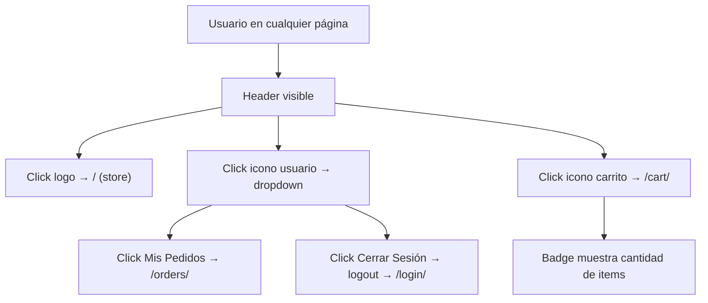

# Frontend - Header Unificado

## DNA (Document Metadata)

| Field | Value |
|-------|-------|
| **Jira** | TBD |
| **Status** | Draft |
| **Author** | Pablo Garay |
| **Date** | 2026-05-21 |
| **Stakeholders** | Equipo TPI |
| **Version** | 0.1 |

---

## 1. Problem Statement

Actualmente el header es parte de la página store (`client/src/pages/client/index.html`) y está acoplado a su CSS y estructura. Cada página (store, cart, orders) tiene su propio header con lógica duplicada. Necesitamos un header independiente, reutilizable en todas las páginas autenticadas, que provea navegación consistente.

---

## 2. Context & Background

- El header actual está definido inline en `client/src/pages/client/index.html` con su propio `<style>`
- La página admin también tiene su propio header en `client/src/pages/admin/index.html`
- No hay un componente header compartido entre páginas
- Se necesita un header con: logo linkeable a store, icono de usuario con dropdown, icono de carrito con badge
- Sin framework (no React/Angular), la solución es tener el mismo HTML/CSS copiado en cada página o crear un sistema de includes vía JS

---

## 3. Goals & Success Metrics

### Primary Goal
Header unificado con logo, navegación a store, icono de usuario con dropdown e icono de carrito con badge, disponible en todas las páginas de la app (menos login/register/forbidden).

---

## 4. Target Users

- **Cliente (USUARIO)**: navega entre store, carrito y pedidos
- **Administrador (ADMIN)**: navega en el panel admin

---

## 5. User Stories

### US-01: Header con navegación a Store
**As a** Usuario autenticado
**I want** ver el logo "Food Store" en el header que me lleve al store
**So that** volver al catálogo desde cualquier página

**Acceptance Criteria:**
- [ ] Logo "Food Store" visible a la izquierda del header
- [ ] Click en logo redirige a `/` (que lleva al store para usuarios autenticados)
- [ ] Header visible en páginas: store, cart, orders (y futuras)
- [ ] Header NO visible en: login, register, forbidden

### US-02: Icono de usuario con dropdown
**As a** Usuario autenticado
**I want** ver un icono de usuario que al clickearlo despliegue un dropdown con "Mis Pedidos" y "Cerrar Sesión"
**So that** acceder rápidamente a mis pedidos o cerrar sesión

**Acceptance Criteria:**
- [ ] Icono de usuario visible a la derecha del header
- [ ] Click en icono abre dropdown con opciones
- [ ] Opción "Mis Pedidos" linkea a `/src/pages/client/orders/`
- [ ] Opción "Cerrar Sesión" ejecuta logout y redirige a login
- [ ] Click fuera del dropdown lo cierra
- [ ] Dropdown tiene estilos: background white, sombra, border radius

### US-03: Icono de carrito con badge
**As a** Usuario autenticado
**I want** ver un icono de carrito con la cantidad de items y que me lleve al carrito
**So that** saber cuántos productos tengo y acceder rápidamente

**Acceptance Criteria:**
- [ ] Icono de carrito visible a la derecha del header (junto al de usuario)
- [ ] Badge numérico sobre el icono muestra la cantidad total de items del carrito
- [ ] Badge se lee de localStorage (`cart` key)
- [ ] Si el carrito está vacío, badge no se muestra (o muestra 0)
- [ ] Click en icono redirige a `/src/pages/client/cart/index.html`

---

## 6. Functional Requirements

### FR-01: Estructura del header
- Mismo HTML/CSS en todas las páginas autenticadas
- Logo + nav (iconos) en flex row, space-between
- Altura fija, fondo primary (`--color-primary: #ff4500`), texto blanco

### FR-02: User dropdown
- Toggle con JS: click en icono muestra/oculta dropdown
- Cerrar dropdown al hacer click fuera (event listener en document)
- Opciones: "Mis Pedidos" (link), "Cerrar Sesión" (ejecuta logout)

### FR-03: Cart badge
- Leer `cart` de localStorage al cargar la página
- Calcular `cart.length` o sumar quantities
- Actualizar badge de forma reactiva (al menos al cargar la página)

---

## 7. User Flow



---

## 8. UI/UX

```
┌──────────────────────────────────────────────────┐
│  Food Store                      👤  🛒  (3)     │
└──────────────────────────────────────────────────┘
                                      ┌────────────┐
                                      │ Mis Pedidos │
                                      │ Cerrar Ses. │
                                      └────────────┘
```

---

## 9. Data Model

```typescript
interface HeaderOptions {
  showCart?: boolean;     // Mostrar icono carrito (default: true)
  showUser?: boolean;     // Mostrar icono usuario (default: true)
}
```

No hay nuevo modelo de datos — usa `localStorage.getItem('cart')` para el badge y `auth.getUserSession()` para el usuario.

---

## 10. Out of Scope

- Header responsive / mobile (postergado)
- Notificaciones en tiempo real
- Dropdown con más opciones (perfil, configuración)
- Admin header unificado (el admin tiene su propio layout)

---

## 11. Dependencies

| Dependency | Type | Status | Impact if Delayed |
|------------|------|--------|-------------------|
| `front-auth` (auth.ts, navigate.ts) | Internal | ✅ Implementado | Necesario para sesión y logout |
| `front-cart` (localStorage key) | Internal | 📄 En PRD | Necesario para badge |

---

## Changelog

| Version | Date | Author | Changes |
|---------|------|--------|---------|
| 0.1 | 2026-05-21 | Pablo Garay | Initial draft |
