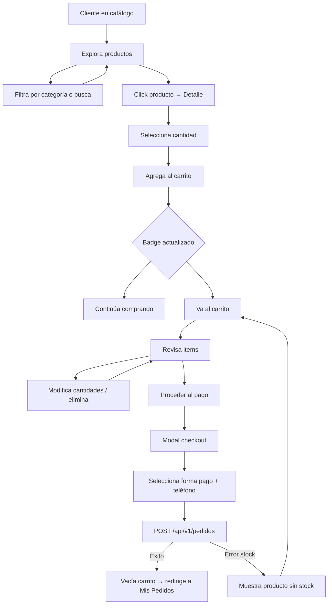

# Frontend - Store

## DNA (Document Metadata)

| Field | Value |
|-------|-------|
| **Jira** | TBD |
| **Status** | Draft |
| **Author** | Pablo Garay |
| **Date** | 2026-05-16 |
| **Stakeholders** | Equipo TPI |
| **Version** | 0.1 |

---

## 1. Problem Statement

El módulo Store del frontend (catálogo de productos, carrito de compras y checkout) actualmente usa datos mockeados en memoria. Necesitamos migrarlo a la API REST real, agregar persistencia del carrito, crear la página de detalle de producto y el flujo completo de checkout con confirmación de pedido.

---

## 2. Context & Background

- **Catálogo** existe en `/src/pages/client/` con productos mockeados
- **Categorías** hardcodeadas en client.ts
- **Carrito** funciona en memoria (se pierde al recargar)
- **Búsqueda** filtra en memoria
- **Sin detalle de producto** individual
- **Sin checkout** ni conexión con pedidos

---

## 3. Goals & Success Metrics

### Primary Goal
Store completo con datos reales desde API, carrito persistente, detalle de producto y checkout transaccional.

---

## 4. Target Users

- **Cliente (USUARIO)**: navega, busca, agrega al carrito, compra

---

## 5. User Stories

### US-01: Catálogo desde API
**As a** Cliente
**I want** ver productos y categorías cargados desde la API
**So that** los datos sean reales y actualizados

**Acceptance Criteria:**
- [ ] `GET /api/v1/categorias` carga el sidebar de categorías
- [ ] `GET /api/v1/productos` carga el grid de productos
- [ ] Cada producto muestra: imagen, nombre, descripción, precio, badge de disponibilidad
- [ ] Si producto no está disponible, se muestra visualmente (opacidad, etiqueta)
- [ ] Contador de productos encontrados
- [ ] Badge del carrito con cantidad de items
- [ ] Sidebar colapsable en mobile

### US-02: Filtros y Búsqueda
**As a** Cliente
**I want** filtrar productos por categoría y buscar por nombre
**So that** encontrar productos rápidamente

**Acceptance Criteria:**
- [ ] Click en categoría filtra productos via `GET /api/v1/productos/categoria/{id}`
- [ ] Búsqueda por texto filtra en frontend (o query param en API)
- [ ] Ordenamiento: nombre A-Z, Z-A, precio ascendente, descendente
- [ ] Al cambiar de categoría, se resetea el input de búsqueda

### US-03: Detalle de Producto
**As a** Cliente
**I want** ver el detalle completo de un producto al hacer clic
**So that** decidir si comprarlo

**Acceptance Criteria:**
- [ ] Ruta: `/src/pages/store/productDetail/index.html?id=1`
- [ ] `GET /api/v1/productos/{id}` carga la data
- [ ] Muestra: imagen grande, nombre, descripción, precio, stock, disponibilidad
- [ ] Selector de cantidad con validación: no > stock, no < 1
- [ ] Botón "Agregar al Carrito" con feedback visual
- [ ] Si no hay stock, botón deshabilitado con mensaje "Sin stock"
- [ ] Botón "Volver" al catálogo
- [ ] Loading spinner mientras carga

### US-04: Carrito Persistente
**As a** Cliente
**I want** que mi carrito se guarde entre sesiones
**So that** no perder los productos seleccionados

**Acceptance Criteria:**
- [ ] Carrito se guarda en localStorage bajo clave `cart`
- [ ] Al agregar producto, se persiste inmediatamente
- [ ] Al recargar la página, carrito se restaura
- [ ] Estructura: `[{ product, quantity }]`
- [ ] Badge en header muestra cantidad total de items

### US-05: Gestión del Carrito
**As a** Cliente
**I want** modificar cantidades y eliminar productos del carrito
**So that** ajustar mi pedido antes de comprar

**Acceptance Criteria:**
- [ ] Botón +/- para modificar cantidad
- [ ] Botón eliminar para quitar producto
- [ ] Precio unitario y subtotal por producto
- [ ] Total general actualizado
- [ ] Botón "Vaciar Carrito"
- [ ] Estado vacío: mensaje + botón "Ir a la tienda"

### US-06: Checkout
**As a** Cliente
**I want** confirmar mi pedido con forma de pago y teléfono
**So that** finalizar la compra

**Acceptance Criteria:**
- [ ] Botón "Proceder al Pago" en el carrito
- [ ] Modal de checkout con: forma de pago (select) y teléfono (requerido)
- [ ] Forma de pago: TARJETA, TRANSFERENCIA, EFECTIVO
- [ ] Validación: teléfono requerido
- [ ] Al confirmar: `POST /api/v1/pedidos`
- [ ] Éxito: toast + redirigir a "Mis Pedidos"
- [ ] Error (sin stock): mostrar qué producto falló
- [ ] Al confirmar, carrito se vacía

---

## 6. Functional Requirements

### FR-01: Store Home
- Sidebar de categorías (GET /api/v1/categorias)
- Grid de productos (GET /api/v1/productos)
- Búsqueda y filtros
- Badge del carrito en header

### FR-02: Detalle de Producto
- Vista individual con info completa
- Selector de cantidad con límite de stock
- Botón agregar al carrito
- Loading + error states

### FR-03: Carrito
- Persistencia en localStorage
- CRUD de items (+/-, eliminar, vaciar)
- Cálculo de totales
- Badge en header

### FR-04: Checkout
- Modal con formulario
- POST /api/v1/pedidos
- Manejo de errores (stock insuficiente)
- Redirección post-éxito

---

## 7. User Flow


```

---

## 8. API / Interface Contracts

### GET `/api/v1/productos`
**Response 200:**
```json
[
  {
    "id": 1,
    "nombre": "Hamburguesa Triple",
    "precio": 25000.00,
    "descripcion": "Triple carne, cheddar y bacon",
    "stock": 50,
    "imagen": "https://...",
    "disponible": true,
    "categoria": { "id": 1, "nombre": "Hamburguesas" }
  }
]
```

### GET `/api/v1/productos/{id}`
**Response 200:** Mismo formato individual.

### POST `/api/v1/pedidos`
```json
{
  "formaPago": "TARJETA",
  "detalles": [
    { "idProducto": 1, "cantidad": 2 },
    { "idProducto": 3, "cantidad": 1 }
  ]
}
```
**Response 201:** Pedido creado con detalles y total.

---

## 9. Data Model (Frontend)

### CartItem
```typescript
interface CartItem {
  product: ProductResponse;
  quantity: number;
}
```

### ProductResponse (desde API)
```typescript
interface ProductResponse {
  id: number;
  nombre: string;
  precio: number;
  descripcion: string;
  stock: number;
  imagen: string;
  disponible: boolean;
  categoria: { id: number; nombre: string };
}
```

---

## 10. DoD (Definition of Done)

### Testing
- [ ] Catálogo carga productos desde API correctamente
- [ ] Filtro por categoría funciona
- [ ] Búsqueda filtra correctamente
- [ ] Detalle producto carga y muestra info completa
- [ ] Selector de cantidad respeta stock máximo
- [ ] Agregar al carrito persiste en localStorage
- [ ] Carrito se restaura al recargar página
- [ ] +/- y eliminar funcionan correctamente
- [ ] Checkout envía pedido y vacía carrito
- [ ] Error de stock muestra mensaje adecuado
- [ ] Estado vacío del carrito se muestra correctamente

### Código
- [ ] `client.ts` refactorizado: datos desde API, no mockeados
- [ ] Página detalle de producto creada (`/src/pages/store/productDetail/`)
- [ ] Carrito con persistencia en localStorage
- [ ] Modal de checkout con validaciones
- [ ] Manejo de estados: loading, error, empty
- [ ] Sin `alert()` — toasts o feedback visual
- [ ] Badge del carrito en el header
- [ ] Contador de productos en resultados

---

## 11. Out of Scope

- Wishlist / favoritos
- Comparación de productos
- Reviews / valoraciones
- Cupones de descuento

---

## 12. Dependencies

| Dependency | Type |
|------------|------|
| back-products | API |
| back-categories | API |
| back-orders | API |
| front-auth | Internal (JWT) |

---

## Changelog

| Version | Date | Author | Changes |
|---------|------|--------|---------|
| 0.1 | 2026-05-16 | Pablo Garay | Initial draft |
